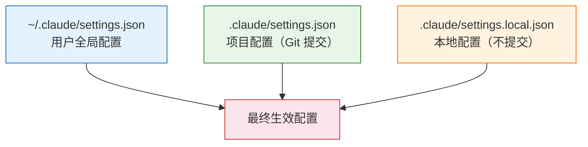

# Settings 深度配置

Claude Code 的配置体系分为三个层级，从全局到本地逐层覆盖。理解这套配置系统，可以让你精确控制 Claude Code 的行为、权限和工作环境。

## 三层配置架构



| 文件 | 位置 | 提交到 Git | 用途 |
|------|------|-----------|------|
| `~/.claude/settings.json` | 用户主目录 | 否 | 所有项目共享的全局偏好 |
| `.claude/settings.json` | 项目根目录 | 是 | 团队共享的项目配置 |
| `.claude/settings.local.json` | 项目根目录 | 否 | 个人本地覆盖 |

::: tip 优先级
本地 > 项目 > 全局。同一个配置项在多层出现时，更具体的层级优先。
:::

## 完整配置项一览

### model — 默认模型

```json
{
  "model": "claude-sonnet-4-20250514"
}
```

可选值：
- `claude-sonnet-4-20250514` — 默认，均衡的速度和质量
- `claude-opus-4-20250514` — 最强推理能力，适合复杂任务
- `claude-haiku-3-20250307` — 最快速度，适合简单任务

### effort — 推理深度

```json
{
  "effort": "high"
}
```

| 值 | 说明 |
|----|------|
| `low` | 快速回答，减少深度思考 |
| `medium` | 默认，平衡速度和质量 |
| `high` | 深度推理，适合复杂问题 |

### permissions — 权限配置

权限系统是 Claude Code 安全模型的核心。分为三个级别：

```json
{
  "permissions": {
    "allow": [
      "Read",
      "Glob",
      "Grep",
      "WebSearch"
    ],
    "ask": [
      "Edit",
      "Write",
      "Bash(*)"
    ],
    "deny": [
      "Bash(rm -rf *)",
      "Bash(git push --force)"
    ]
  }
}
```

| 级别 | 行为 |
|------|------|
| `allow` | 自动执行，不需要确认 |
| `ask` | 每次执行前询问用户确认 |
| `deny` | 完全禁止，不会尝试执行 |

#### Glob 模式匹配

权限支持 glob 模式，精细控制工具的使用范围：

```json
{
  "permissions": {
    "allow": [
      "Bash(npm test)",
      "Bash(npm run lint)",
      "Bash(git status)",
      "Bash(git diff*)",
      "Edit(src/**/*.ts)",
      "Edit(src/**/*.tsx)"
    ],
    "deny": [
      "Bash(rm *)",
      "Bash(git push*)",
      "Edit(node_modules/**)",
      "Edit(.env*)"
    ]
  }
}
```

::: warning 项目配置的权限限制
`.claude/settings.json`（项目配置）中只能设置 `deny` 规则，不能设置 `allow`。这是安全设计——项目维护者不应能自动授权工具执行。`allow` 规则只能在用户级别（`~/.claude/settings.json`）或本地配置中设置。
:::

### env — 环境变量

为 Claude Code 会话注入环境变量：

```json
{
  "env": {
    "NODE_ENV": "development",
    "DEBUG": "app:*",
    "DATABASE_URL": "postgresql://localhost:5432/mydb"
  }
}
```

::: danger 不要在 settings.json 中放密钥
`settings.json` 可能被提交到 Git。API Key、Token 等敏感信息应该通过系统环境变量或 `.env` 文件管理，不要写在 settings 中。
:::

### hooks — 自动化钩子

Hooks 允许你在特定事件发生时自动执行脚本：

```json
{
  "hooks": {
    "on_session_start": [
      {
        "command": "echo 'Session started at $(date)' >> ~/.claude/session.log"
      }
    ],
    "on_tool_use": [
      {
        "tool": "Edit",
        "command": "npm run lint --fix $CLAUDE_FILE_PATH"
      }
    ],
    "on_session_end": [
      {
        "command": "echo 'Session ended' >> ~/.claude/session.log"
      }
    ]
  }
}
```

可用的 Hook 事件：

| 事件 | 触发时机 |
|------|---------|
| `on_session_start` | 会话开始时 |
| `on_session_end` | 会话结束时 |
| `on_tool_use` | 使用特定工具时 |

### sandbox — 沙盒配置

控制命令执行的隔离环境：

```json
{
  "sandbox": {
    "enabled": true,
    "network": true,
    "writePaths": ["/tmp", "./dist", "./build"]
  }
}
```

### statusLine — 状态栏自定义

自定义 Claude Code 界面底部的状态栏信息：

```json
{
  "statusLine": "🚀 {{model}} | {{tokens}} tokens | {{cost}}"
}
```

### enabledPlugins — 启用的插件

配置哪些 MCP 插件在会话中可用：

```json
{
  "enabledPlugins": [
    "plugin:telegram:telegram",
    "plugin:github:github",
    "plugin:context7:context7"
  ]
}
```

## 常用环境变量

除了 `env` 配置项，以下环境变量会影响 Claude Code 的行为：

| 变量 | 说明 |
|------|------|
| `ANTHROPIC_API_KEY` | Anthropic API 密钥 |
| `CLAUDE_CODE_NO_FLICKER` | 设为 `1` 减少终端闪烁 |
| `CLAUDE_CODE_MAX_OUTPUT_TOKENS` | 限制单次输出的最大 token 数 |
| `CLAUDE_CODE_USE_BEDROCK` | 使用 AWS Bedrock 作为后端 |
| `CLAUDE_CODE_USE_VERTEX` | 使用 Google Vertex AI 作为后端 |
| `HTTPS_PROXY` | HTTP 代理地址 |

```bash
# 在 shell 配置中设置
export ANTHROPIC_API_KEY="sk-ant-..."
export CLAUDE_CODE_NO_FLICKER=1

# 或在启动时临时设置
ANTHROPIC_API_KEY="sk-ant-..." claude
```

## 实战配置示例

### 个人全局配置

```json
// ~/.claude/settings.json
{
  "model": "claude-sonnet-4-20250514",
  "effort": "medium",
  "permissions": {
    "allow": [
      "Read",
      "Glob",
      "Grep",
      "WebSearch",
      "WebFetch",
      "Bash(git status)",
      "Bash(git diff*)",
      "Bash(git log*)",
      "Bash(npm test)",
      "Bash(npm run lint)",
      "Bash(npx tsc --noEmit)"
    ],
    "deny": [
      "Bash(rm -rf *)",
      "Bash(git push --force*)",
      "Bash(curl * | bash)",
      "Edit(.env*)"
    ]
  }
}
```

### 团队项目配置

```json
// .claude/settings.json
{
  "permissions": {
    "deny": [
      "Edit(packages/legacy/**)",
      "Bash(npm publish*)",
      "Bash(docker push*)"
    ]
  },
  "hooks": {
    "on_tool_use": [
      {
        "tool": "Edit",
        "command": "npx prettier --write $CLAUDE_FILE_PATH"
      }
    ]
  }
}
```

### 个人本地覆盖

```json
// .claude/settings.local.json
{
  "model": "claude-opus-4-20250514",
  "effort": "high",
  "env": {
    "DATABASE_URL": "postgresql://localhost:5433/mydb_dev"
  }
}
```

## 使用 /config 管理配置

在 Claude Code 会话中，使用 `/config` 命令可以交互式地查看和修改配置：

```bash
# 打开配置管理
/config

# Claude 会显示当前生效的配置
# 并引导你进行修改
```

也可以使用 `/update-config` skill 进行更结构化的配置修改：

```bash
/update-config
```

## 配置调试

当配置不按预期工作时：

1. **检查生效的配置** — 使用 `/config` 查看最终合并后的配置
2. **确认文件位置** — 确保配置文件在正确的目录下
3. **检查 JSON 语法** — 配置文件必须是合法的 JSON
4. **注意层级覆盖** — 本地配置会覆盖项目配置和全局配置
5. **重启会话** — 部分配置修改需要重启 Claude Code 才能生效

::: tip 配置验证
如果配置文件有语法错误，Claude Code 启动时会给出警告。注意 JSON 不支持注释，上面示例中的 `//` 注释仅用于说明。
:::

## 最佳实践

1. **全局配置放通用偏好** — 模型选择、常用工具权限、不变的安全规则
2. **项目配置放团队约定** — 禁止修改的目录、自动格式化 Hook、项目特有的限制
3. **本地配置放个人差异** — 数据库连接、模型偏好、调试选项
4. **权限遵循最小授权** — 只 allow 确定安全的操作，其余保持 ask
5. **定期审查 deny 列表** — 确保危险操作始终被禁止
6. **不要在配置中存密钥** — 使用环境变量或 `.env` 文件

---

上一篇：[Vibe Coding 技巧 ←](/zh/tutorials/vibe-coding) | 下一篇：[自定义 Skills 开发 →](/zh/advanced/custom-skills)
