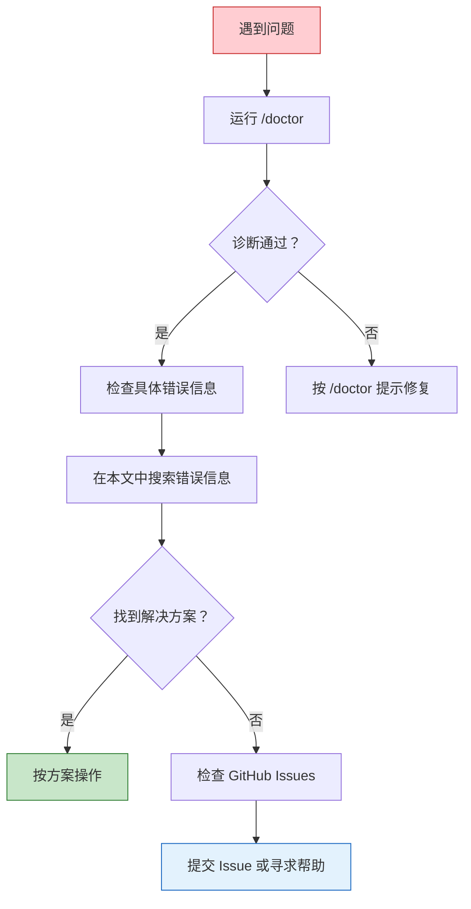

# 常见问题排查

本篇汇总 Claude Code 使用中的常见问题及解决方案。遇到问题时，先运行 `/doctor` 命令进行自动诊断，再对照下文排查。

## 快速诊断：/doctor

```bash
# 在 Claude Code 中运行
/doctor

# 或在终端中直接运行
claude doctor
```

`/doctor` 会自动检查：
- Node.js 版本是否兼容
- 认证状态是否正常
- 网络连接是否通畅
- 配置文件是否有效
- 已安装的插件状态

## 安装问题

### Node.js 版本不兼容

**问题：** 安装或启动时报错 `Unsupported Node.js version`

**解决：**

```bash
# 检查当前版本
node --version

# Claude Code 要求 Node.js >= 18
# 使用 nvm 安装推荐版本
nvm install 20
nvm use 20

# 重新安装
npm install -g @anthropic-ai/claude-code
```

### 安装权限不足

**问题：** `EACCES: permission denied` 错误

**解决：**

```bash
# 方法 1：使用 nvm（推荐）
# nvm 安装的 Node.js 不需要 sudo
nvm install 20
npm install -g @anthropic-ai/claude-code

# 方法 2：修改 npm 全局目录
mkdir ~/.npm-global
npm config set prefix '~/.npm-global'
# 将 ~/.npm-global/bin 添加到 PATH
export PATH="$HOME/.npm-global/bin:$PATH"
npm install -g @anthropic-ai/claude-code
```

::: warning 不要用 sudo
避免使用 `sudo npm install -g`，这会导致后续的权限问题。
:::

### 代理设置

**问题：** 网络受限环境下无法安装或连接

**解决：**

```bash
# 设置 npm 代理
npm config set proxy http://your-proxy:port
npm config set https-proxy http://your-proxy:port

# 设置 Claude Code 的代理
export HTTPS_PROXY="http://your-proxy:port"
export HTTP_PROXY="http://your-proxy:port"

# 启动 Claude Code
claude
```

## 认证问题

### 登录失败

**问题：** `claude login` 无法完成认证

**解决：**

```bash
# 1. 检查当前认证状态
claude auth status

# 2. 清除旧的认证信息重新登录
claude logout
claude login

# 3. 如果浏览器无法打开，手动复制 URL
# Claude 会在终端输出登录链接
```

### API Key vs OAuth

| 认证方式 | 适用场景 | 设置方法 |
|---------|---------|---------|
| OAuth（默认） | 个人使用，交互式登录 | `claude login` |
| API Key | CI/CD、脚本、无界面环境 | 设置 `ANTHROPIC_API_KEY` 环境变量 |

```bash
# 使用 API Key
export ANTHROPIC_API_KEY="sk-ant-api03-..."
claude -p "你好"

# 验证 API Key 是否有效
claude auth status
```

### SSO / 组织认证

**问题：** 组织要求 SSO 登录

**解决：**

```bash
# 使用组织 ID 登录
claude login --org your-org-id

# 如果遇到 SSO 跳转问题
# 确保默认浏览器可以正常打开
# 或手动在浏览器中访问输出的 URL
```

## 性能问题

### 响应速度慢

**问题：** Claude 的回复需要很长时间

**可能原因和解决方案：**

| 原因 | 解决 |
|------|------|
| 上下文太大 | 使用 `/compact` 压缩或开始新会话 |
| 模型选择不当 | 简单任务切换到 Haiku：`/model` |
| effort 设置过高 | 降低 effort：在 settings 中设置 |
| 网络延迟 | 检查代理设置，使用就近节点 |
| 项目文件太多 | 使用 `.claudeignore` 排除不需要的目录 |

### 内存占用高

**问题：** Claude Code 进程占用过多内存

**解决：**

```bash
# 检查 Node.js 内存使用
# 在会话外执行
ps aux | grep claude

# 减少内存使用的方法
# 1. 定期 /compact 减少内存中的上下文
# 2. 避免在巨大的 monorepo 根目录启动
# 3. 使用 .claudeignore 排除大型目录
```

### 上下文窗口耗尽

**问题：** 提示 context window 已满

**解决：**

```bash
# 方法 1：压缩上下文
/compact

# 方法 2：开始新会话
/exit
claude

# 方法 3：使用 --continue 恢复但带压缩
claude --continue
/compact
```

::: tip .claudeignore
在项目根目录创建 `.claudeignore` 文件（语法同 `.gitignore`），排除不需要 Claude 分析的目录：

```
# .claudeignore
node_modules/
dist/
build/
.git/
*.log
data/
vendor/
```
:::

## 工具错误

### Permission Denied

**问题：** 工具执行被拒绝

**解决：**

```bash
# 1. 检查权限配置
/config

# 2. 工具可能在 deny 列表中
# 检查 settings.json 的 permissions 配置
# 确认目标工具不在 deny 中

# 3. 临时授权
# 当 Claude 询问权限时选择 y
# 或在 settings.json 中将工具加入 allow
```

### Hook 执行失败

**问题：** 配置的 Hook 报错

**解决：**

```bash
# 1. 检查 Hook 命令是否可以独立运行
# 手动在终端测试 Hook 中的命令

# 2. 检查路径和权限
which prettier  # 确认命令存在
chmod +x scripts/my-hook.sh  # 确认可执行

# 3. 检查 settings.json 中的 Hook 配置
# 确保 JSON 格式正确
```

### MCP 连接问题

**问题：** MCP Server 无法连接或工具不可用

**解决：**

```bash
# 1. 检查插件状态
/doctor

# 2. 确认插件已启用
# 在 settings.json 中检查 enabledPlugins

# 3. 检查 MCP Server 是否运行
# 部分 MCP Server 需要额外的认证或配置

# 4. 重启 Claude Code 会话
/exit
claude
```

## 常见错误信息

### `ECONNREFUSED` / `ETIMEDOUT`

```
Error: connect ECONNREFUSED 127.0.0.1:443
```

**原因：** 网络连接失败，可能是代理问题或 API 服务不可达。

**解决：**
```bash
# 检查网络
curl -I https://api.anthropic.com

# 检查代理配置
echo $HTTPS_PROXY

# 如果使用 VPN，尝试切换节点
```

### `invalid_api_key`

```
Error: Invalid API key provided
```

**原因：** API Key 无效或过期。

**解决：**
```bash
# 检查环境变量
echo $ANTHROPIC_API_KEY

# 确认 Key 格式正确（以 sk-ant- 开头）
# 在 Anthropic Console 检查 Key 状态
# 重新生成 Key 如果已过期
```

### `context_length_exceeded`

```
Error: Context length exceeded
```

**原因：** 上下文超过了模型的最大限制。

**解决：**
```bash
# 立即压缩
/compact

# 或开始新会话
/exit
claude
```

### `rate_limit_error`

```
Error: Rate limit exceeded
```

**原因：** API 请求频率超过限制。

**解决：**
- 等待几秒后重试
- 减少并行的 Claude Code 会话数
- 检查 API 套餐的速率限制
- 考虑升级 API 计划

### `tool_use_error`

```
Error: Tool execution failed
```

**原因：** 工具（如 Bash、Edit）执行过程中出错。

**解决：**
```bash
# 1. 查看详细错误信息
# Claude 通常会显示具体的错误原因

# 2. 常见情况
# - Bash 命令不存在：安装缺失的工具
# - 文件不存在：检查路径
# - 权限不足：检查文件和目录权限

# 3. 手动执行命令确认
# 在终端中直接运行 Claude 尝试执行的命令
```

## Git 相关问题

### Claude 的 Git 操作被拒绝

**问题：** Claude 尝试 git push 等操作被拦截

**解决：** 这是安全设计。危险的 Git 操作默认需要确认。

```bash
# 在 settings.json 中配置安全的 Git 操作
{
  "permissions": {
    "allow": [
      "Bash(git status)",
      "Bash(git diff*)",
      "Bash(git log*)",
      "Bash(git add *)",
      "Bash(git commit *)"
    ],
    "deny": [
      "Bash(git push --force*)",
      "Bash(git reset --hard*)"
    ]
  }
}
```

### Commit 信息不符合规范

**问题：** Claude 生成的 commit message 不符合团队规范

**解决：** 在 CLAUDE.md 中明确规范：

```markdown
## Git Conventions
- Commit format: `type(scope): description`
- Types: feat, fix, docs, style, refactor, test, chore
- Example: `feat(auth): add OAuth2 login support`
- Always write commit messages in English
```

## 排查流程总结

当遇到问题时，按以下顺序排查：



1. **先跑 `/doctor`** — 自动诊断常见问题
2. **看错误信息** — 通常包含问题的关键线索
3. **查本文** — 对照常见问题和解决方案
4. **搜 GitHub Issues** — 其他用户可能遇到过同样的问题
5. **提 Issue** — 附上错误日志和环境信息

---

上一篇：[性能优化 ←](/zh/advanced/performance-tips)
