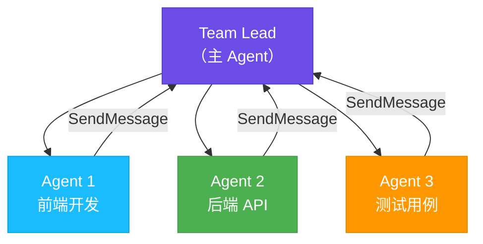
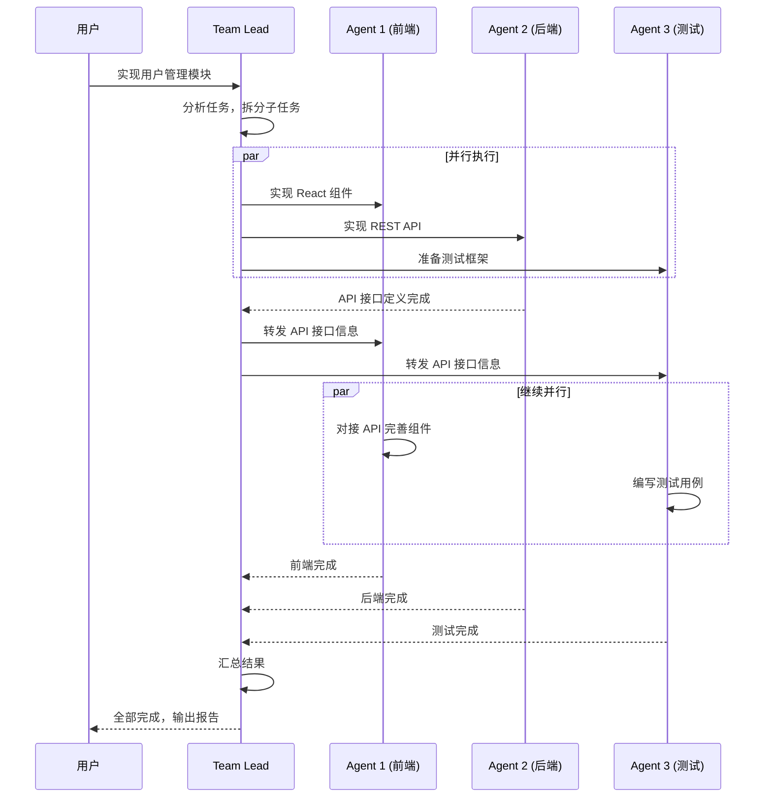

# Agent Teams 多智能体协作

Agent Teams 是 Claude Code 的**实验性功能**，让多个 AI 智能体像一个团队一样并行协作，同时处理不同的子任务。想象一下：一个 Team Lead 指挥前端工程师、后端工程师、测试工程师同时开工 —— 这就是 Agent Teams 做的事。

## 什么是 Agent Teams

在传统模式下，Claude Code 是单线程工作的：一个任务完成后才开始下一个。而 Agent Teams 打破了这个限制，引入了**团队协作**模式：



| 对比维度 | 普通模式 | Agent Teams |
|---------|---------|-------------|
| 执行方式 | 串行，逐个完成 | 并行，同时执行 |
| 任务粒度 | 单一任务流 | 多个独立子任务 |
| 适用场景 | 简单/线性任务 | 复杂/可拆分任务 |
| 上下文 | 共享单一上下文 | 每个 Agent 独立上下文 |

## 何时使用 Agent Teams

Agent Teams 并不适合所有场景。它在以下情况下最有价值：

**适合使用的场景**：
- 全栈功能开发（前端 + 后端 + 测试可以并行）
- 多个独立模块的修改
- 大规模重构中互不依赖的部分
- 同时处理文档、代码、测试

**不适合使用的场景**：
- 简单的单文件修改
- 任务之间有强依赖关系（B 必须等 A 完成）
- 调试单一 bug
- 需要频繁交互确认的任务

::: tip 判断标准
问自己：**"这个任务能不能拆成几个互不干扰的子任务？"** 如果能，Agent Teams 就值得尝试。
:::

## 如何启用

Agent Teams 目前是实验性功能，需要通过启动参数开启：

```bash
claude --agent-teams
```

或者在配置中启用：

```json
// ~/.claude/settings.json
{
  "agentTeams": true
}
```

::: warning 实验性功能
Agent Teams 仍在积极开发中，API 和行为可能会变化。建议在非关键任务中先熟悉它的工作方式。
:::

## 工作原理

Agent Teams 的核心是一套**任务管理和通信系统**，由以下关键操作组成：

### 任务生命周期


### 核心操作详解

#### 1. TeamCreate — 创建团队

Team Lead（主 Agent）首先创建一个工作团队，定义整体目标。

#### 2. TaskCreate — 创建子任务

将大任务拆分为具体的子任务，每个子任务有明确的描述和预期输出。

```
TaskCreate:
  - task: "实现用户列表 React 组件"
    type: "frontend"
  - task: "实现 /api/users REST API"
    type: "backend"
  - task: "编写用户模块单元测试"
    type: "testing"
```

#### 3. Spawn Agents — 启动智能体

为每个子任务分配一个独立的 Agent。每个 Agent 拥有独立的上下文和工具访问权限。

#### 4. SendMessage — 通信协调

Agent 之间可以通过消息传递进行协调：

- **Agent -> Team Lead**：报告进度、请求帮助、提交结果
- **Team Lead -> Agent**：提供指导、更新需求、协调冲突
- **Agent -> Agent**：直接交换信息（如前端需要后端的 API 接口定义）

#### 5. TaskUpdate — 更新任务状态

每个任务有明确的状态流转：

| 状态 | 说明 |
|------|------|
| `pending` | 等待开始 |
| `in_progress` | 正在执行 |
| `blocked` | 被阻塞，等待依赖 |
| `completed` | 已完成 |
| `failed` | 执行失败 |

#### 6. TaskList / TaskGet — 查看任务

Team Lead 可以随时查看所有任务的状态和进度。

## Agent 类型

Agent Teams 中可以使用不同类型的 Agent，各有专长：

| Agent 类型 | 专长 | 适用任务 |
|-----------|------|---------|
| **general-purpose** | 通用编码 | 任何开发任务 |
| **Explore** | 代码探索 | 理解代码库结构、查找相关文件 |
| **Plan** | 规划 | 分析需求、制定实施方案 |
| **code-reviewer** | 代码审查 | 检查代码质量、发现问题 |

::: tip 选择合适的 Agent
大多数情况下使用 `general-purpose` 类型就够了。只有在需要特定能力时才选择专门类型。
:::

## 空闲状态管理

当一个 Agent 完成了自己的任务但团队整体还未完成时，它会进入 **idle（空闲）** 状态。Team Lead 可以：

- 给它分配新任务
- 让它帮助其他还在忙的 Agent
- 让它进行代码审查
- 释放它以节省资源

## 实战示例：全栈用户管理功能

假设你要开发一个完整的"用户管理"功能，包含前端页面、后端 API 和测试。

### 对话示例

```
你: 帮我实现一个用户管理模块，包括：
    - 前端：用户列表页 + 用户详情页（React + TailwindCSS）
    - 后端：CRUD REST API（Express + Prisma）
    - 测试：前后端的单元测试和集成测试

Claude Code (Team Lead): 好的，我来组建团队并行开发。

[创建团队]
Team: user-management-feature

[创建任务并分配 Agent]
Agent 1 (前端): 实现用户列表和详情页 React 组件
Agent 2 (后端): 实现用户 CRUD API 和数据库模型
Agent 3 (测试): 编写测试用例

[并行执行]
Agent 2 → Team Lead: "API 接口定义好了，路由是 /api/users"
Team Lead → Agent 1: "后端 API 路径是 /api/users，请据此实现数据获取"
Team Lead → Agent 3: "API 和组件结构已确定，可以开始写测试了"

[完成汇总]
Team Lead: 所有任务完成！
- 前端：2 个页面组件 + 路由配置
- 后端：5 个 API 端点 + Prisma 模型
- 测试：12 个测试用例，全部通过
```

### 协作流程图



## 任务列表系统

Agent Teams 使用结构化的任务列表来跟踪所有工作：

### TaskCreate — 创建任务

```
TaskCreate:
  title: "实现用户列表组件"
  description: "使用 React + TailwindCSS 实现可分页的用户列表"
  assignee: agent-1
  priority: high
  dependencies: []
```

### TaskList — 查看所有任务

```
TaskList:
  ┌──────────┬───────────────────┬────────────┬──────────┐
  │ ID       │ 任务              │ 状态        │ 负责人    │
  ├──────────┼───────────────────┼────────────┼──────────┤
  │ task-1   │ 用户列表组件       │ completed  │ agent-1  │
  │ task-2   │ REST API          │ in_progress│ agent-2  │
  │ task-3   │ 单元测试          │ pending    │ agent-3  │
  └──────────┴───────────────────┴────────────┴──────────┘
```

### TaskGet — 查看任务详情

获取单个任务的详细状态、输出和日志。

### TaskUpdate — 更新任务状态

```
TaskUpdate:
  id: task-1
  status: completed
  output: "已创建 UserList.tsx 和 UserDetail.tsx"
```

## 限制与注意事项

### 当前限制

1. **实验性功能** — API 可能会变化，不建议在关键生产工作流中依赖
2. **资源消耗** — 多个 Agent 并行会消耗更多 API Token
3. **文件冲突** — 多个 Agent 同时修改同一文件可能导致冲突
4. **上下文隔离** — Agent 之间不共享完整上下文，需要通过消息传递信息

### 避免冲突的策略

::: warning 文件冲突是最常见的问题
确保不同 Agent 的任务涉及**不同的文件**。如果无法避免，让 Team Lead 协调修改顺序。
:::

**推荐的任务拆分方式**：

| 拆分维度 | 示例 | 冲突风险 |
|---------|------|---------|
| 按目录 | 前端 `src/pages/` vs 后端 `src/api/` | 低 |
| 按功能模块 | 用户模块 vs 订单模块 | 低 |
| 按文件类型 | 组件代码 vs 测试代码 | 中 |
| 按同一文件 | 同一个 index.ts 的不同函数 | 高 |

## 最佳实践

1. **任务粒度适中** — 太大的任务没法并行，太小的任务通信开销大
2. **明确边界** — 每个 Agent 的职责范围要清晰，避免重叠
3. **减少依赖** — 尽量让子任务独立，减少 Agent 之间的等待
4. **先规划后执行** — 让 Team Lead 先制定完整计划，再分配任务
5. **及时沟通** — 当发现问题时立即通过 SendMessage 通知相关 Agent
6. **逐步尝试** — 先用 2 个 Agent 的小规模团队熟悉机制，再扩展到更大的团队

::: tip 与其他功能配合
Agent Teams 可以与其他 Claude Code 功能组合使用：
- **Plan Mode**：先用 Plan Mode 制定方案，再用 Agent Teams 并行执行
- **Git Worktrees**：每个 Agent 使用独立的 Worktree，彻底避免文件冲突
- **MCP Servers**：Agent 可以各自调用不同的 MCP 工具
:::

---

上一篇：[MCP Servers 外部工具集成 <-](/zh/features/mcp-servers) | 下一篇：[Plan Mode 规划模式 ->](/zh/features/plan-mode)
