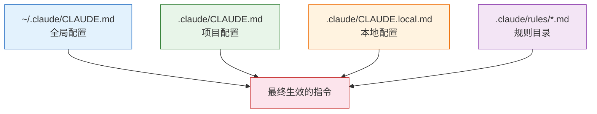
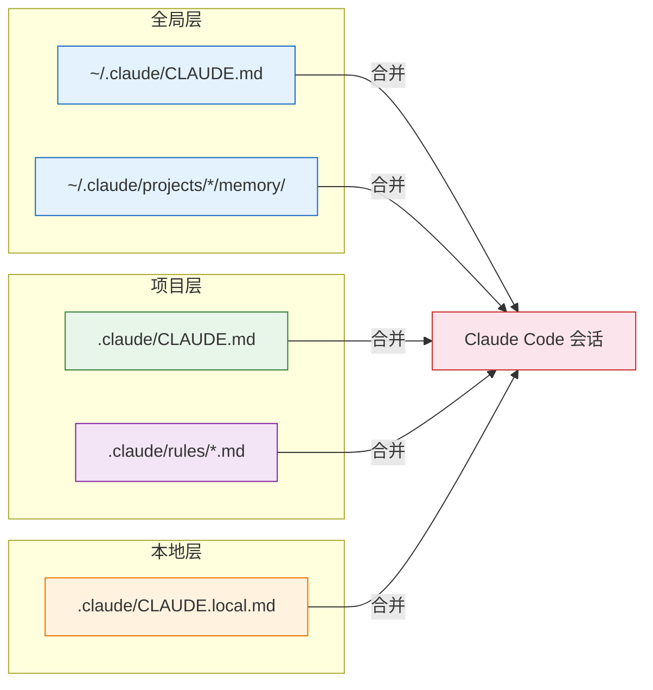

# CLAUDE.md 项目记忆

CLAUDE.md 是 Claude Code 的**项目级指令文件**，让你可以持久化地告诉 Claude 关于你项目的一切：技术栈、编码规范、构建命令、架构决策。Claude Code 在每次会话开始时自动读取这些文件，不需要你每次重复说明。

## 为什么需要 CLAUDE.md

没有 CLAUDE.md 时，你每次启动 Claude Code 都要重复说：

> "我们用 TypeScript + React，CSS 用 Tailwind，测试用 Vitest，构建用 pnpm..."

有了 CLAUDE.md，这些信息只需要写一次，Claude Code 就会**始终遵循**。

## 三层配置体系

CLAUDE.md 采用三层继承结构，从全局到本地逐层覆盖：



### 第一层：全局配置 `~/.claude/CLAUDE.md`

适用于你所有项目的通用偏好设置。

```markdown
<!-- ~/.claude/CLAUDE.md -->

# 全局规则

## 语言偏好
- 使用中文交流，代码和注释使用英文
- 默认使用 TypeScript

## 编码风格
- 优先使用函数式编程风格
- 变量命名使用 camelCase
- 常量使用 UPPER_SNAKE_CASE
```

### 第二层：项目配置 `.claude/CLAUDE.md`

存放在项目根目录下，跟随 Git 提交，**团队共享**。

```markdown
<!-- .claude/CLAUDE.md -->

# 项目规则

## 技术栈
- Framework: Next.js 15 (App Router)
- CSS: Tailwind CSS v4
- Database: PostgreSQL + Drizzle ORM
- Testing: Vitest + Playwright

## 构建命令
- `pnpm dev` — 启动开发服务器
- `pnpm build` — 生产构建
- `pnpm test` — 运行单元测试
- `pnpm test:e2e` — 运行 E2E 测试

## 架构约定
- 所有 API 路由放在 app/api/ 下
- 共享组件放在 components/ui/
- 数据库 schema 在 db/schema.ts
- 不要在 Server Components 中使用 useState/useEffect
```

### 第三层：本地配置 `.claude/CLAUDE.local.md`

个人本地配置，**不提交到 Git**（已被默认 gitignore）。

```markdown
<!-- .claude/CLAUDE.local.md -->

# 本地配置

## 个人偏好
- 我是后端开发，前端代码请写详细注释
- 本地数据库端口是 5433（不是默认的 5432）
- 调试时优先使用 console.log，不用 debugger
```

::: tip 优先级规则
当多层配置冲突时，**更具体的配置优先**：本地 > 项目 > 全局。所有层的内容会合并后一起生效。
:::

## 规则目录 `.claude/rules/`

当 CLAUDE.md 变得太长时，可以拆分成多个规则文件：

```
.claude/
├── CLAUDE.md              # 主配置文件
└── rules/
    ├── coding-style.md    # 编码风格
    ├── testing.md         # 测试规范
    ├── git-workflow.md    # Git 工作流
    └── api-design.md     # API 设计规范
```

规则文件的写法和 CLAUDE.md 完全一样：

```markdown
<!-- .claude/rules/testing.md -->

# 测试规范

- 每个新功能必须有对应的测试
- 测试文件放在同级的 __tests__/ 目录
- 测试命名：`[功能名].test.ts`
- 使用 describe/it 结构，it 描述用英文
- Mock 外部依赖，不 mock 内部模块
- 覆盖率目标：语句 80%，分支 70%
```

::: tip 规则文件的加载
`.claude/rules/` 下所有 `.md` 文件都会被自动读取，文件名仅用于组织管理，不影响优先级。
:::

## 自动记忆系统

除了手动编写的 CLAUDE.md，Claude Code 还有一个**自动记忆系统**，保存在：

```
~/.claude/projects/<project-hash>/memory/
├── MEMORY.md          # 记忆索引
├── user_profile.md    # 用户画像
├── tech_stack.md      # 技术栈记忆
└── decisions.md       # 历史决策
```

自动记忆会根据你的使用习惯和对话历史，自动积累项目知识。

### `/memory` 命令

在会话中随时使用 `/memory` 命令来管理记忆：

```bash
# 查看当前记忆
/memory

# Claude 会显示已记住的内容，你可以：
# - 要求它记住新的信息
# - 修改错误的记忆
# - 删除不再需要的记忆
```

### `/init` 命令

在一个新项目中快速生成 CLAUDE.md：

```bash
# 在项目根目录运行
/init

# Claude 会自动：
# 1. 扫描项目结构
# 2. 检测技术栈和构建工具
# 3. 读取 package.json / pyproject.toml 等配置
# 4. 生成一份 CLAUDE.md 初稿
```

::: warning 注意
`/init` 生成的只是初稿，建议根据团队实际情况手动调整后再提交。
:::

## CLAUDE.md 应该写什么

### 推荐写入的内容

| 类别 | 示例 |
|------|------|
| 技术栈 | 框架、语言版本、关键依赖 |
| 构建命令 | dev / build / test / lint 命令 |
| 编码规范 | 命名、格式、文件组织 |
| 架构决策 | 目录结构、模块划分、设计模式 |
| 项目约定 | Git 分支策略、PR 流程、部署流程 |
| 常见陷阱 | 容易出错的地方、历史遗留问题 |
| 不做的事 | 明确写出"不要做什么" |

### 一个完整的实战示例

```markdown
# Project: my-saas-app

## Tech Stack
- Next.js 15 (App Router) + TypeScript 5.6
- Tailwind CSS v4 + shadcn/ui
- PostgreSQL 16 + Drizzle ORM
- Auth: Better Auth
- Deploy: Vercel

## Commands
- `pnpm dev` — dev server on port 3000
- `pnpm build` — production build
- `pnpm db:push` — push schema changes
- `pnpm db:studio` — open Drizzle Studio
- `pnpm test` — run Vitest
- `pnpm lint` — ESLint + Prettier check

## Architecture
- `app/` — Next.js App Router pages and API routes
- `components/ui/` — shadcn/ui components (DO NOT modify)
- `components/` — custom components
- `lib/` — shared utilities and configurations
- `db/` — database schema and migrations
- `actions/` — server actions

## Conventions
- Use Server Components by default; only add "use client" when needed
- Server Actions for mutations, NOT API routes
- Use Drizzle query builder, not raw SQL
- All form validation with Zod schemas in `lib/validations/`
- Error handling: use Result pattern, avoid try-catch in business logic

## Do NOT
- Do NOT use `getServerSession()` — use `auth()` from Better Auth
- Do NOT put business logic in API routes — use server actions
- Do NOT modify files in `components/ui/` — these are managed by shadcn
- Do NOT use `any` type — use `unknown` and narrow with type guards
```

## 什么不应该放在 CLAUDE.md

::: warning 避免写入这些内容
- **密钥和敏感信息** — API Key、密码、Token 等绝对不要写入
- **大段代码** — CLAUDE.md 不是代码库，写规则而不是实现
- **频繁变化的内容** — 比如当前 Sprint 任务、临时 TODO
- **显而易见的事** — 比如"JavaScript 用分号结尾"这类语言默认规范
- **过于冗长的说明** — 保持简洁，每条规则 1-2 行
:::

## 配置体系总览



## 最佳实践

1. **团队共享项目配置** — `.claude/CLAUDE.md` 提交到 Git，让团队成员共享统一的 AI 协作规范
2. **个人差异用本地配置** — 开发环境差异、个人偏好放 `.claude/CLAUDE.local.md`
3. **规则文件分门别类** — 内容多时用 `.claude/rules/` 拆分，一个文件聚焦一个主题
4. **写"不做什么"** — 负面规则往往比正面规则更有效（避免 Claude 走弯路）
5. **保持简洁** — 每条规则 1-2 行，用列表而非段落
6. **定期更新** — 项目演进时同步更新 CLAUDE.md，用 `/memory` 管理自动记忆
7. **用 `/init` 起步** — 新项目不要从零写，让 Claude 帮你生成初稿

---

上一篇：[Plan Mode 规划模式 ←](/zh/features/plan-mode) | 下一篇：[Hooks 自动化 →](/zh/features/hooks)
