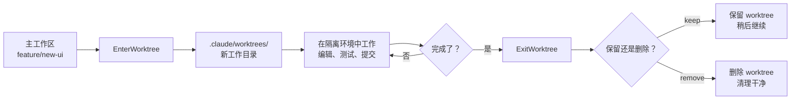
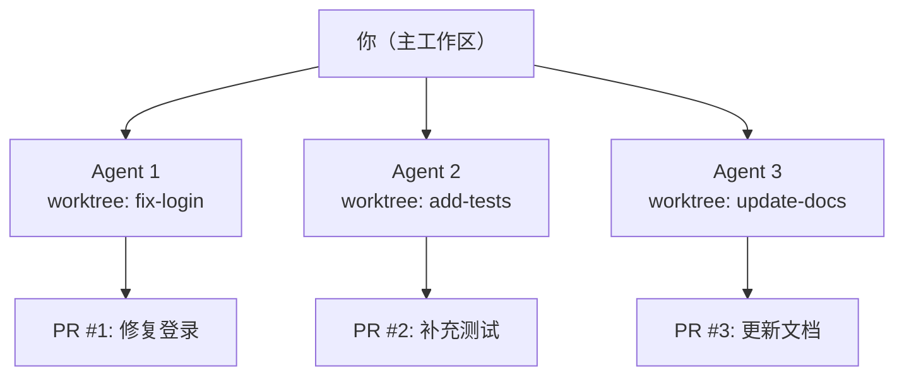

# Git Worktrees 并行开发

在日常开发中，你经常需要在多个分支之间切换——修 bug、开新功能、做代码评审。传统做法是 `git stash` 再 `checkout`，但这容易丢失上下文。Claude Code 的 **Git Worktrees** 功能让你可以同时在多个分支上工作，互不干扰。

## 什么是 Git Worktree

Git Worktree 是 Git 内置的功能，允许你在同一个仓库中创建**多个工作目录**，每个目录对应一个不同的分支。

```
传统方式:  一个仓库目录 → stash → checkout → 切换分支 → 恢复 stash
Worktree:  一个仓库 → 多个独立目录 → 每个目录对应一个分支 → 并行工作
```

每个 worktree 都是仓库的一个**独立副本**，有自己的工作目录和暂存区，但共享同一份 Git 历史。这意味着你可以在一个 worktree 里写新功能，同时在另一个 worktree 里修 bug，完全不需要来回切换。

::: tip 核心优势
Worktree 不是完整的 `git clone`——它共享 `.git` 对象数据库，创建速度快、磁盘占用小。
:::

## 为什么需要 Worktree

### 1. 避免 stash 的痛苦

传统工作流中，你正在开发一个功能，突然需要修一个紧急 bug：

```bash
# 传统方式：容易出错
git stash                    # 暂存当前工作
git checkout main            # 切到主分支
git checkout -b hotfix/xxx   # 创建修复分支
# ... 修复 bug ...
git checkout feature/xxx     # 切回功能分支
git stash pop                # 恢复暂存（可能冲突！）
```

使用 worktree，你的功能开发完全不会被打断。

### 2. 并行 Agent 工作

Claude Code 最强大的用法之一是让多个 Agent 同时工作。每个 Agent 需要一个独立的工作目录，worktree 就是为此而生。

### 3. 隔离实验性改动

想尝试一种新的架构方案？在 worktree 里折腾，不影响主工作区。实验失败了，删掉 worktree 即可。

## Worktree 工作流

下面的流程图展示了 Claude Code 中使用 worktree 的典型工作流：



## 在 Claude Code 中使用

### 方式一：交互式命令

在 Claude Code 对话中，使用 `/worktree` 命令或直接说"在 worktree 中工作"：

```bash
> /worktree

# 或者用自然语言
> 帮我创建一个 worktree 来修复 login 页面的 bug
```

Claude 会调用 `EnterWorktree` 工具，自动创建一个隔离的工作目录：

```
✅ Created worktree at .claude/worktrees/fix-login-bug
   Branch: fix-login-bug (based on HEAD)
   Working directory switched to new worktree
```

### 方式二：CLI 启动参数

在启动 Claude Code 时直接指定 worktree 模式：

```bash
# 使用 --worktree 或 -w 标志
claude --worktree

# 简写形式
claude -w
```

这会在启动时自动创建 worktree，非常适合快速开始一个隔离任务。

### 方式三：Agent 工具参数

在使用 Agent 工具（子代理）时，可以通过 `isolation` 参数让子代理在 worktree 中运行：

```
使用 Agent 工具，设置 isolation: "worktree"，
让子代理在独立的 worktree 中实现用户认证模块
```

## Worktree 存储位置

所有由 Claude Code 创建的 worktree 都存储在项目根目录的 `.claude/worktrees/` 下：

```
my-project/
├── .claude/
│   └── worktrees/
│       ├── fix-login-bug/      ← worktree 1
│       │   ├── src/
│       │   ├── package.json
│       │   └── ...
│       └── refactor-auth/      ← worktree 2
│           ├── src/
│           ├── package.json
│           └── ...
├── src/                        ← 主工作区
├── package.json
└── ...
```

::: warning 注意事项
`.claude/worktrees/` 目录应该被加入 `.gitignore`，不要提交到仓库中。
:::

## 退出 Worktree

完成工作后，使用 `ExitWorktree` 退出：

```bash
> 退出 worktree

# Claude 会询问你的选择
```

你有两个选择：

| 操作 | 说明 | 适用场景 |
|------|------|----------|
| `keep` | 保留 worktree 目录和分支 | 工作未完成，稍后继续 |
| `remove` | 删除 worktree 目录和分支 | 工作已完成或放弃 |

```bash
# 保留 worktree（稍后可以回来继续）
ExitWorktree: action = "keep"

# 删除 worktree（清理干净）
ExitWorktree: action = "remove"
```

::: tip 安全保护
如果 worktree 中有未提交的更改或未合并的 commit，`remove` 操作会被拒绝。你需要先提交或显式确认丢弃更改（`discard_changes: true`）。
:::

## 结合 tmux 使用

对于长时间运行的任务，可以结合 `--tmux` 标志创建持久化的 worktree 会话：

```bash
# 在 tmux 会话中启动 worktree
claude --worktree --tmux

# 或者简写
claude -w --tmux
```

这样即使你关闭终端，Agent 仍然在后台运行。你可以随时重新连接：

```bash
# 查看正在运行的 tmux 会话
tmux list-sessions

# 重新连接
tmux attach -t <session-name>
```

## 实战示例：并行开发

假设你正在开发一个新的 Dashboard 页面，突然产品报了一个紧急 bug——用户无法登录。

### 步骤 1：在 worktree 中修 bug

```bash
# 你正在主工作区开发 Dashboard
> 帮我创建一个 worktree 来修复登录 bug

Claude:
  ✅ Created worktree at .claude/worktrees/fix-login
  Now working in: .claude/worktrees/fix-login
```

### 步骤 2：在隔离环境中修复

```bash
> 用户点击登录按钮后页面一直 loading，帮我排查原因

Claude:
  🔍 Reading src/auth/login.ts
  🔍 Reading src/api/auth-service.ts
  🔧 Running: npm test -- --grep "login"

  找到问题了：auth-service.ts 中的 token 刷新逻辑有一个
  竞态条件，当网络慢时会导致死循环...

  ✏️ Editing src/api/auth-service.ts
  ✏️ Editing src/auth/__tests__/login.test.ts
```

### 步骤 3：提交修复

```bash
> 提交这个修复

Claude:
  🔧 Running: git add -A
  🔧 Running: git commit -m "fix: resolve race condition in token refresh"
```

### 步骤 4：退出 worktree，回到 Dashboard 开发

```bash
> 退出 worktree，删除它

Claude:
  ✅ Exited worktree. Removed .claude/worktrees/fix-login
  Back to: ~/my-project (feature/dashboard)
```

你的 Dashboard 开发代码完好无损，一行都没动过。

## 多 Agent 并行工作

Worktree 的真正威力在于与多 Agent 配合使用：



```bash
# 让多个子代理在各自的 worktree 中并行工作
> 用三个子代理同时处理：
  1. 修复登录 bug（worktree 隔离）
  2. 为 auth 模块补充单元测试（worktree 隔离）
  3. 更新 API 文档（worktree 隔离）
```

每个 Agent 在自己的 worktree 中独立工作，不会互相冲突。

## 最佳实践

### 命名规范

给 worktree 起有意义的名字，方便管理：

```bash
# 好的命名
claude --worktree  # 让 Claude 自动命名
> 创建一个名为 fix-auth-race-condition 的 worktree

# 避免无意义的命名
> 创建一个叫 test1 的 worktree  # ❌ 不推荐
```

### 及时清理

完成工作后记得删除不再需要的 worktree，避免磁盘空间浪费：

```bash
# 查看现有的 worktree
> !git worktree list

# 清理已完成的 worktree
> 退出并删除这个 worktree
```

### 合理使用场景

| 场景 | 是否推荐使用 Worktree |
|------|----------------------|
| 修复紧急 bug，不想中断当前开发 | 推荐 |
| 并行运行多个 Agent | 推荐 |
| 尝试实验性方案 | 推荐 |
| 简单的单文件修改 | 不需要 |
| 已经在干净的分支上 | 不需要 |

### 避免常见问题

::: warning 注意事项
1. **不要手动修改** `.claude/worktrees/` 目录结构，使用 `ExitWorktree` 管理
2. **不要在多个 worktree 中检出同一个分支**——Git 不允许这样做
3. **大型仓库**创建 worktree 可能需要一些时间，因为需要检出文件
4. worktree 中的 `node_modules` 等依赖目录需要**单独安装**
:::

## 小结

Git Worktrees 是 Claude Code 中实现并行开发的核心功能：

- **隔离性**——每个 worktree 是独立的工作空间，互不影响
- **轻量级**——共享 Git 对象数据库，创建和销毁都很快
- **多 Agent 协作**——每个 Agent 在自己的 worktree 中工作，避免冲突
- **灵活管理**——用完即删，或者保留稍后继续

掌握 worktree 的使用，你就能真正发挥 Claude Code 的并行处理能力，像管理团队一样管理多个 AI Agent。

---

> 上一篇：[Agent Teams 多代理协作](./agent-teams.md)
>
> 下一篇：[Plan Mode 安全规划](./plan-mode.md)
