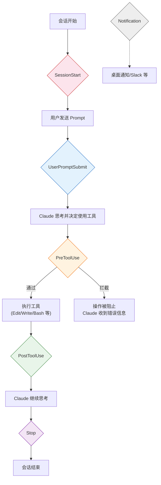

# Hooks 自动化

Hooks 是 Claude Code 的**事件驱动自动化系统**，让你可以在特定操作发生前后自动执行 Shell 命令或脚本。就像 Git Hooks 一样，但作用于 Claude Code 的每一个动作。

## 为什么需要 Hooks

没有 Hooks 时，你只能在对话中反复叮嘱 Claude：

> "不要改 .env 文件"、"每次写完代码跑一下 prettier"、"不要 force push"

有了 Hooks，这些规则可以变成**自动执行的脚本**，Claude Code 违反规则时会被直接拦截。

## Hook 的生命周期



## 配置方式

Hooks 在 `~/.claude/settings.json`（全局）或项目的 `.claude/settings.json` 中配置：

```jsonc
// ~/.claude/settings.json
{
  "hooks": {
    "PreToolUse": [
      {
        "matcher": "Edit|Write",
        "command": "/path/to/check-protected-files.sh"
      }
    ],
    "PostToolUse": [
      {
        "matcher": "Write",
        "command": "prettier --write $CLAUDE_FILE_PATH"
      }
    ],
    "SessionStart": [
      {
        "command": "echo 'Session started at $(date)' >> ~/.claude/session.log"
      }
    ]
  }
}
```

## 所有 Hook 事件

| 事件 | 触发时机 | 典型用途 |
|------|----------|----------|
| `SessionStart` | 会话开始时 | 环境检查、日志记录 |
| `UserPromptSubmit` | 用户发送消息后 | 输入过滤、上下文注入 |
| `PreToolUse` | 工具执行前 | 拦截危险操作、文件保护 |
| `PostToolUse` | 工具执行后 | 自动格式化、lint 检查 |
| `Notification` | Claude 发送通知时 | 桌面提醒、发消息到 Slack |
| `Stop` | Claude 完成回答时 | 清理、日志记录 |

## Hook 配置详解

每个 Hook 条目支持以下字段：

```jsonc
{
  "matcher": "Edit|Write",   // 仅 PreToolUse/PostToolUse 需要，匹配工具名
  "command": "./my-hook.sh"  // 要执行的 Shell 命令
}
```

- **`matcher`** — 正则表达式，匹配触发 Hook 的工具名称。常见工具名：`Edit`、`Write`、`Bash`、`Read`、`Glob`、`Grep`
- **`command`** — 任意 Shell 命令或脚本路径

### Hook 脚本接收的输入

Hook 脚本通过 **stdin** 接收一个 JSON 对象，包含事件的详细信息：

```jsonc
// PreToolUse 的 stdin 示例
{
  "tool_name": "Edit",
  "tool_input": {
    "file_path": "/path/to/file.ts",
    "old_string": "...",
    "new_string": "..."
  }
}
```

### Hook 脚本的输出

| 退出码 | 含义 |
|--------|------|
| `0` | 通过，继续执行 |
| 非 `0` | 拦截（仅 PreToolUse），操作被阻止 |

对于 `PreToolUse`，脚本的 **stderr** 输出会作为错误信息反馈给 Claude，让它知道为什么操作被拦截。

---

## 实战示例

### 示例 1：保护敏感文件

阻止 Claude 编辑 `.env`、密钥文件等敏感文件：

```bash
#!/bin/bash
# protect-sensitive-files.sh
# PreToolUse hook for Edit/Write

INPUT=$(cat)
FILE_PATH=$(echo "$INPUT" | jq -r '.tool_input.file_path // empty')

# 定义受保护的文件模式
PROTECTED_PATTERNS=(
  "\.env"
  "\.env\."
  "secrets"
  "credentials"
  "\.pem$"
  "\.key$"
  "id_rsa"
)

for pattern in "${PROTECTED_PATTERNS[@]}"; do
  if echo "$FILE_PATH" | grep -qE "$pattern"; then
    echo "BLOCKED: Cannot modify protected file: $FILE_PATH" >&2
    echo "This file matches protected pattern: $pattern" >&2
    exit 1
  fi
done

exit 0
```

配置：

```jsonc
{
  "hooks": {
    "PreToolUse": [
      {
        "matcher": "Edit|Write",
        "command": "bash /path/to/protect-sensitive-files.sh"
      }
    ]
  }
}
```

::: warning 安全提醒
Hooks 是硬性防线，比 CLAUDE.md 中写"不要修改 .env"更可靠。CLAUDE.md 是建议，Hooks 是强制。
:::

### 示例 2：Git 安全防护

阻止危险的 Git 操作：

```bash
#!/bin/bash
# git-safety.sh
# PreToolUse hook for Bash

INPUT=$(cat)
COMMAND=$(echo "$INPUT" | jq -r '.tool_input.command // empty')

# 危险命令列表
DANGEROUS_PATTERNS=(
  "git push.*--force"
  "git push.*-f "
  "git reset --hard"
  "git checkout \."
  "git clean -f"
  "git branch -D"
)

for pattern in "${DANGEROUS_PATTERNS[@]}"; do
  if echo "$COMMAND" | grep -qE "$pattern"; then
    echo "BLOCKED: Dangerous git command detected: $COMMAND" >&2
    echo "Pattern matched: $pattern" >&2
    echo "Use non-destructive alternatives instead." >&2
    exit 1
  fi
done

exit 0
```

配置：

```jsonc
{
  "hooks": {
    "PreToolUse": [
      {
        "matcher": "Bash",
        "command": "bash /path/to/git-safety.sh"
      }
    ]
  }
}
```

### 示例 3：自动格式化代码

每次 Claude 写入文件后自动运行 Prettier：

```bash
#!/bin/bash
# auto-format.sh
# PostToolUse hook for Write

INPUT=$(cat)
FILE_PATH=$(echo "$INPUT" | jq -r '.tool_input.file_path // empty')

# 只格式化支持的文件类型
if echo "$FILE_PATH" | grep -qE '\.(ts|tsx|js|jsx|json|css|md)$'; then
  npx prettier --write "$FILE_PATH" 2>/dev/null
fi

exit 0
```

配置：

```jsonc
{
  "hooks": {
    "PostToolUse": [
      {
        "matcher": "Write",
        "command": "bash /path/to/auto-format.sh"
      }
    ]
  }
}
```

::: tip PostToolUse 的退出码
PostToolUse 的退出码不会阻止操作（操作已经完成了），但非零退出码会让 Claude 知道后处理出了问题。
:::

### 示例 4：桌面通知

当 Claude 完成耗时任务后发送系统通知：

```bash
#!/bin/bash
# notify.sh
# Notification hook

INPUT=$(cat)
MESSAGE=$(echo "$INPUT" | jq -r '.message // "Claude Code notification"')

# macOS 通知
osascript -e "display notification \"$MESSAGE\" with title \"Claude Code\""

# Linux (需要 notify-send)
# notify-send "Claude Code" "$MESSAGE"

exit 0
```

配置：

```jsonc
{
  "hooks": {
    "Notification": [
      {
        "command": "bash /path/to/notify.sh"
      }
    ]
  }
}
```

### 示例 5：会话启动检查

在每次会话开始时检查开发环境：

```bash
#!/bin/bash
# session-check.sh
# SessionStart hook

# 检查 Node.js 版本
NODE_VERSION=$(node -v 2>/dev/null)
if [ -z "$NODE_VERSION" ]; then
  echo "WARNING: Node.js not found" >&2
fi

# 检查是否在 Git 仓库中
if ! git rev-parse --is-inside-work-tree &>/dev/null; then
  echo "WARNING: Not in a git repository" >&2
fi

# 检查依赖是否安装
if [ -f "package.json" ] && [ ! -d "node_modules" ]; then
  echo "WARNING: node_modules not found, running install..." >&2
  npm install
fi

exit 0
```

---

## 组合多个 Hooks

同一个事件可以配置多个 Hook，它们会**按顺序执行**：

```jsonc
{
  "hooks": {
    "PreToolUse": [
      {
        "matcher": "Edit|Write",
        "command": "bash /path/to/protect-sensitive-files.sh"
      },
      {
        "matcher": "Bash",
        "command": "bash /path/to/git-safety.sh"
      },
      {
        "matcher": "Bash",
        "command": "bash /path/to/block-rm-rf.sh"
      }
    ],
    "PostToolUse": [
      {
        "matcher": "Write",
        "command": "bash /path/to/auto-format.sh"
      },
      {
        "matcher": "Write",
        "command": "bash /path/to/auto-lint.sh"
      }
    ],
    "Notification": [
      {
        "command": "bash /path/to/notify.sh"
      }
    ]
  }
}
```

::: tip 执行顺序
对于 `PreToolUse`，如果任何一个 Hook 返回非零退出码，后续的 Hook **不会执行**，操作直接被拦截。
:::

## 绕过 Hooks

在特殊情况下需要临时跳过所有 Hooks：

```bash
CLAUDE_BYPASS_HOOKS=1 claude
```

::: warning 谨慎使用
绕过 Hooks 意味着你放弃了所有安全防护。仅在调试 Hook 本身或紧急情况下使用。
:::

## Hook 调试技巧

1. **先在终端单独测试脚本**

```bash
echo '{"tool_name":"Edit","tool_input":{"file_path":".env"}}' | bash protect-sensitive-files.sh
echo $?  # 应该返回 1（拦截）
```

2. **检查 jq 是否安装** — 大多数 Hook 脚本依赖 `jq` 解析 JSON

```bash
which jq || brew install jq
```

3. **使用 stderr 输出调试信息** — stdout 不会显示，stderr 才会反馈给 Claude

4. **检查脚本权限**

```bash
chmod +x /path/to/your-hook.sh
```

## Hooks vs CLAUDE.md

| 维度 | CLAUDE.md | Hooks |
|------|-----------|-------|
| 性质 | 建议/指令 | 强制执行 |
| 执行方式 | Claude 自觉遵守 | 系统级拦截 |
| 灵活性 | 高（自然语言） | 中（Shell 脚本） |
| 可靠性 | 可能被忽略 | 100% 执行 |
| 适用场景 | 编码风格、架构决策 | 安全防护、自动化流程 |

::: tip 搭配使用
最佳实践是两者搭配：CLAUDE.md 定义"应该怎么做"，Hooks 强制"不能怎么做"。
:::

## 最佳实践

1. **安全防护用 Hook** — 文件保护、危险命令拦截必须用 Hook，不要仅靠 CLAUDE.md
2. **脚本要幂等** — Hook 脚本可能被多次调用，确保重复执行不会出问题
3. **保持脚本简单快速** — Hook 在每次工具调用时执行，太慢会影响体验
4. **充分利用 stderr** — 拦截时给 Claude 清晰的错误信息，它会据此调整行为
5. **版本控制 Hook 脚本** — 把脚本放在项目的 `.claude/hooks/` 目录并提交到 Git
6. **先测试再上线** — 用 `echo | bash your-hook.sh` 在终端验证后再配置
7. **渐进式添加** — 从最重要的安全 Hook 开始，逐步增加自动化流程

---

上一篇：[CLAUDE.md 项目记忆 ←](/zh/features/claude-md) | 下一篇：[Skills 自定义命令 →](/zh/features/skills)
