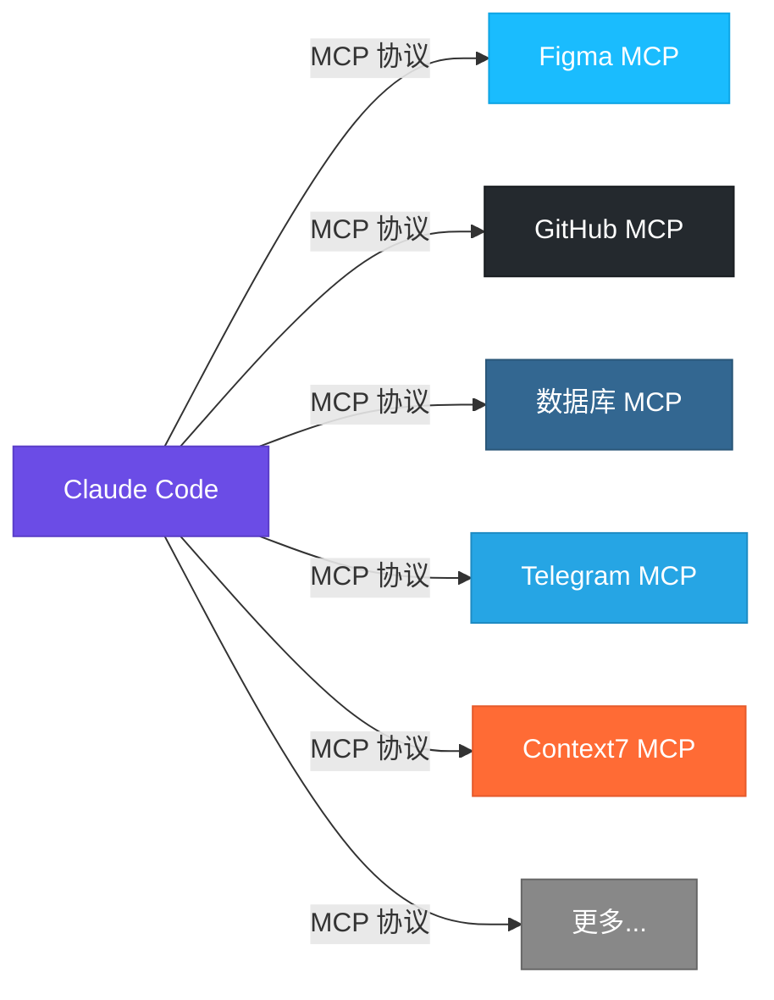
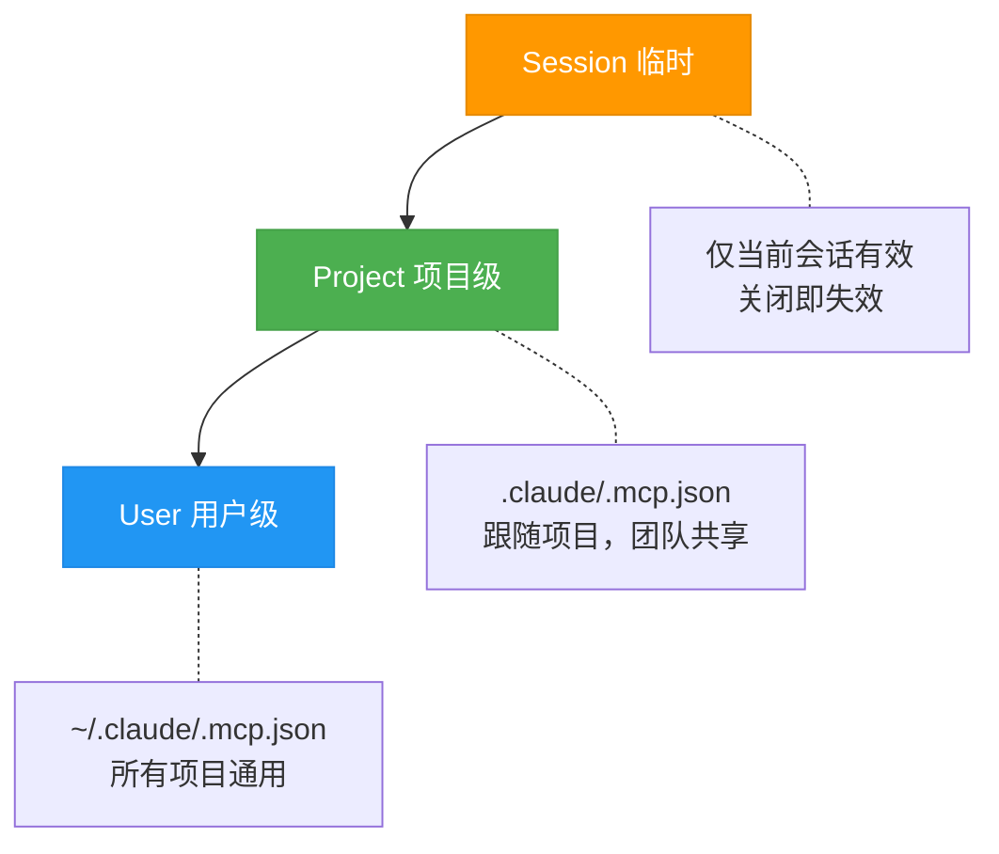
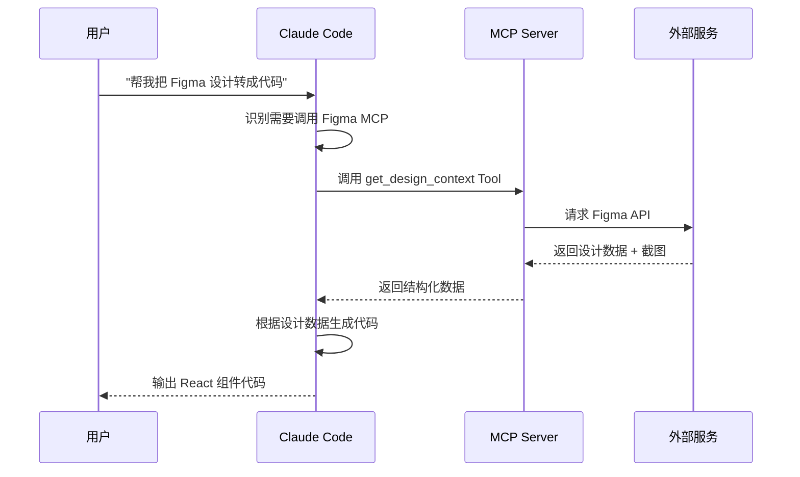

# MCP Servers 外部工具集成

MCP（Model Context Protocol）是 Claude Code 连接外部工具和服务的**标准化协议**。如果说 Claude Code 本身是一台强大的电脑，那 MCP 就是它的 **USB 接口** —— 让你可以把任何工具"插"上去使用。

## 什么是 MCP

MCP 全称 **Model Context Protocol**（模型上下文协议），由 Anthropic 开源推出。它定义了一套标准通信协议，让 AI 模型能够与外部工具、数据源、服务进行交互。



::: tip USB 类比
就像 USB 协议让你的电脑可以连接键盘、鼠标、摄像头、硬盘等各种设备一样，MCP 让 Claude Code 可以连接 Figma、GitHub、数据库、消息平台等各种服务。你不需要关心底层通信细节，只需要"插上"就能用。
:::

## MCP 提供什么

每个 MCP Server 可以向 Claude Code 暴露三种能力：

| 类型 | 说明 | 示例 |
|------|------|------|
| **Tools** | 可执行的操作 | 读取 Figma 设计、发送 Telegram 消息、查询数据库 |
| **Resources** | 可读取的数据源 | 文档内容、API 数据、文件系统 |
| **Prompts** | 预定义的提示模板 | 代码审查模板、设计分析模板 |

其中 **Tools** 是最常用的能力，大多数 MCP Server 主要通过 Tools 与 Claude Code 交互。

## 两种传输方式

MCP 支持两种传输方式，适用于不同场景：

### stdio — 本地进程

通过标准输入/输出与本地进程通信，MCP Server 作为子进程运行在你的机器上。运行在本地、低延迟、无需网络。

```json
{
  "mcpServers": {
    "filesystem": {
      "command": "npx",
      "args": ["-y", "@modelcontextprotocol/server-filesystem", "/path/to/dir"]
    }
  }
}
```

### HTTP/SSE — 远程服务

通过 HTTP 和 Server-Sent Events 与远程服务通信。支持认证授权，适合云端 API 和 SaaS 平台。

```json
{
  "mcpServers": {
    "remote-service": {
      "type": "sse",
      "url": "https://mcp.example.com/sse"
    }
  }
}
```

## 三种配置作用域

MCP Server 的配置有三个层级，从临时到持久：



### 1. Session（会话级）

通过 `/mcp` 命令在当前会话中临时添加，关闭 Claude Code 后失效。适合临时调试和测试。

### 2. Project（项目级）

配置在项目根目录的 `.claude/.mcp.json` 中，所有打开该项目的人都会加载。适合团队共享的工具。

```bash
# 文件位置
your-project/.claude/.mcp.json
```

### 3. User（用户级）

配置在用户目录的 `~/.claude/.mcp.json` 中，所有项目通用。适合个人常用工具。

```bash
# 文件位置
~/.claude/.mcp.json
```

::: warning 优先级
当同名 MCP Server 在多个层级都有配置时，**越具体的优先级越高**：Session > Project > User。
:::

## 如何添加 MCP Server

### 方法一：`/mcp` 命令（推荐）

```bash
/mcp
# 进入 MCP 管理界面，选择 "Add Server"，按提示输入名称、命令、参数
```

### 方法二：手动编辑配置文件

直接编辑 `.claude/.mcp.json` 或 `~/.claude/.mcp.json`：

```json
{
  "mcpServers": {
    "server-name": {
      "command": "npx",
      "args": ["-y", "package-name"],
      "env": {
        "API_KEY": "your-api-key"
      }
    }
  }
}
```

### 方法三：`--mcp-config` 启动参数

```bash
claude --mcp-config /path/to/custom-mcp.json
```

适合在不同场景切换不同的 MCP 配置集。

## 配置文件格式

```json
{
  "mcpServers": {
    "local-server": {
      "command": "npx",
      "args": ["-y", "@scope/mcp-server-name"],
      "env": {
        "API_KEY": "your-key"
      }
    },
    "remote-server": {
      "type": "sse",
      "url": "https://mcp.example.com/sse",
      "headers": {
        "Authorization": "Bearer your-token"
      }
    }
  }
}
```

::: tip 环境变量安全
**不要**在项目级 `.mcp.json` 中硬编码 API Key。推荐：使用环境变量引用 `"API_KEY": "${FIGMA_TOKEN}"`，或将密钥配置放在用户级 `~/.claude/.mcp.json` 中。
:::

## 常用 MCP Server 实战

### Figma MCP — 设计转代码

将 Figma 设计稿直接转换为代码，是设计师和开发者协作的利器。

```json
{
  "mcpServers": {
    "figma": {
      "command": "npx",
      "args": ["-y", "@anthropic/figma-mcp-server"],
      "env": {
        "FIGMA_ACCESS_TOKEN": "${FIGMA_ACCESS_TOKEN}"
      }
    }
  }
}
```

**使用方式** — 给 Claude Code 发送 Figma 链接：

```
"帮我把这个 Figma 设计实现成 React 组件：
https://figma.com/design/abc123/MyDesign?node-id=1-2"
```

### Context7 — 实时文档查询

查询任何库/框架的最新文档，确保代码使用的是最新 API。

```json
{
  "mcpServers": {
    "context7": {
      "command": "npx",
      "args": ["-y", "@context7/mcp-server"]
    }
  }
}
```

**使用方式** — Claude Code 会通过 Context7 查询最新文档，而不是依赖可能过时的训练数据：

```
"Next.js 15 的 Server Actions 怎么用？帮我查一下最新文档"
```

### Telegram MCP — 消息集成

让 Claude Code 可以通过 Telegram Bot 收发消息。

```json
{
  "mcpServers": {
    "telegram": {
      "command": "npx",
      "args": ["-y", "@anthropic/telegram-mcp-server"],
      "env": {
        "TELEGRAM_BOT_TOKEN": "${TELEGRAM_BOT_TOKEN}"
      }
    }
  }
}
```

**使用场景**：
- 长时间运行的任务完成后通知你
- 在 Telegram 中直接与 Claude Code 交互
- 接收部署状态更新

### GitHub MCP — Issue 和 PR 管理

增强 Claude Code 与 GitHub 的集成能力。

```json
{
  "mcpServers": {
    "github": {
      "command": "npx",
      "args": ["-y", "@anthropic/github-mcp-server"],
      "env": {
        "GITHUB_TOKEN": "${GITHUB_TOKEN}"
      }
    }
  }
}
```

**使用场景**：
- 查看和管理 Issue / PR
- 自动创建 PR 并填写描述
- 查看 CI/CD 检查结果

### 数据库 MCP — 直接查询

连接数据库，让 Claude Code 可以直接查询和分析数据。

```json
{
  "mcpServers": {
    "postgres": {
      "command": "npx",
      "args": ["-y", "@modelcontextprotocol/server-postgres"],
      "env": {
        "DATABASE_URL": "${DATABASE_URL}"
      }
    }
  }
}
```

::: warning 安全提醒
数据库 MCP 建议只连接**只读副本**或开发环境数据库。生产数据库请务必使用只读连接，避免误操作。
:::

## MCP 工作流示意

一个典型的 MCP 调用流程：



### 排查常见问题

### Server 启动失败

**排查**：确认命令能在终端独立运行 `npx -y @scope/mcp-server`，检查 Node.js 版本（需要 18+），检查环境变量是否齐全。

### 工具调用超时

**可能原因**：网络问题、外部服务慢、MCP Server 进程崩溃。通过 `/mcp` 命令删除后重新添加来重启。

### 权限/认证问题

**排查**：检查 API Key / Token 是否正确、权限是否足够、是否过期。

::: tip 调试技巧
在 Claude Code 中使用 `/mcp` 命令可以查看所有已连接的 MCP Server 状态，包括可用的 Tools 列表。这是排查问题的第一步。
:::

## 最佳实践

1. **按需加载** — 只添加当前项目需要的 MCP Server，过多的 Server 会增加启动时间和 Token 消耗
2. **分层管理** — 通用工具放用户级，项目专属放项目级
3. **安全第一** — API Key 不要提交到代码仓库，使用环境变量
4. **版本锁定** — 在 `args` 中指定包版本号，避免自动更新导致不兼容
5. **定期清理** — 移除不再使用的 MCP Server 配置

---

上一篇：[Skills 自定义命令 <-](/zh/features/skills) | 下一篇：[Agent Teams 多智能体协作 ->](/zh/features/agent-teams)
