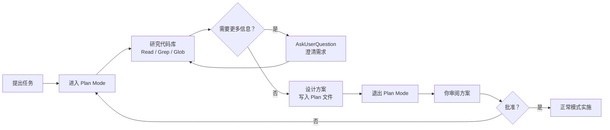

# Plan Mode 安全规划

在动手写代码之前先想清楚——这是资深工程师的习惯。Claude Code 的 **Plan Mode** 把这个理念工具化了：它提供一个**只读的探索阶段**，让 Claude 可以充分研究代码库、设计方案，但**不能修改任何文件**。

## 什么是 Plan Mode

Plan Mode 是 Claude Code 的一种特殊工作模式。在这个模式下：

```
普通模式:  研究 → 规划 → 编辑文件 → 执行命令 → 完成
Plan Mode: 研究 → 规划 → 输出方案 → [等待你确认] → 退出后再实施
```

你可以把它理解为一个**安全沙箱**——Claude 拥有完整的代码阅读和搜索能力，但被禁止做任何破坏性操作。

::: tip 核心理念
"先规划，后实施"不是浪费时间——它能避免错误的方向上浪费更多时间。Plan Mode 确保 Claude 在动手之前真正理解了问题。
:::

## 什么时候该用 Plan Mode

### 推荐使用的场景

| 场景 | 为什么需要先规划 |
|------|-----------------|
| 跨多个文件的重构 | 需要理解模块间依赖关系 |
| 新功能的架构设计 | 需要评估不同实现方案 |
| 不熟悉的代码库 | 需要先梳理项目结构 |
| 有风险的数据库迁移 | 需要评估影响范围 |
| 性能优化 | 需要先定位瓶颈 |

### 不需要 Plan Mode 的场景

- 简单的单文件 bug 修复
- 改一行配置
- 已经明确知道怎么改的小任务
- 添加一个已知格式的文件

::: info 判断标准
如果你能一句话描述清楚"改哪里、怎么改"，就不需要 Plan Mode。如果你需要说"先调研一下"，那就适合用 Plan Mode。
:::

## 如何进入 Plan Mode

### 方式一：斜杠命令

在 Claude Code 对话中使用 `/plan` 命令：

```bash
> /plan

Claude:
  ✅ Entered Plan Mode
  我现在处于规划模式，可以阅读和搜索代码，但不会修改任何文件。
  告诉我你想要规划什么？
```

### 方式二：CLI 启动参数

启动时直接进入 Plan Mode：

```bash
# 使用 --permission-mode 参数
claude --permission-mode plan

# 整个会话都在 Plan Mode 下运行
```

### 方式三：工具调用

Claude 也可以通过 `EnterPlanMode` 工具主动进入规划模式：

```bash
> 我想给项目添加用户权限系统，先帮我规划一下

Claude:
  这是一个涉及多个模块的改动，我先进入规划模式研究一下。
  🔒 Entering Plan Mode...
```

## Plan Mode 能做什么

在 Plan Mode 中，Claude 拥有完整的**只读探索能力**：

### 可用的工具

```bash
✅ Read       — 读取任意文件内容
✅ Glob       — 按模式搜索文件名
✅ Grep       — 在文件内容中搜索
✅ WebSearch  — 搜索网络信息
✅ WebFetch   — 获取网页内容
✅ AskUser    — 向你提问以澄清需求
```

### 不可用的工具

```bash
❌ Edit       — 编辑文件
❌ Write      — 写入新文件
❌ Bash       — 执行终端命令（破坏性操作）
❌ NotebookEdit — 编辑 Jupyter Notebook
```

::: warning 严格隔离
Plan Mode 中的限制是**强制性**的，不是建议性的。即使你在提示词中要求 Claude 编辑文件，它也做不到。这是一层硬性保护。
:::

## Plan Mode 工作流

下面的流程图展示了完整的 Plan Mode 工作流：



## Plan 文件

Claude 在规划过程中会将方案写入 `.claude/plans/` 目录：

```
my-project/
├── .claude/
│   └── plans/
│       └── add-auth-system.md    ← 规划文档
├── src/
└── ...
```

Plan 文件通常包含：

```markdown
# 用户权限系统实施方案

## 目标
为现有应用添加基于角色的访问控制（RBAC）

## 现状分析
- 当前认证：JWT token，仅区分登录/未登录
- 用户模型：`src/models/user.ts`，无角色字段
- API 路由：`src/routes/` 下 15 个端点，均无权限检查

## 方案设计

### 数据模型变更
1. User 表添加 `role` 字段
2. 新增 Permission 表
3. 新增 RolePermission 关联表

### 中间件实现
1. 创建 `src/middleware/authorize.ts`
2. 在路由级别添加权限检查

### 影响范围
- 需要修改 8 个文件
- 需要新增 4 个文件
- 需要 1 次数据库迁移

## 实施步骤（按顺序）
1. 数据库 migration
2. 更新 User model
3. 创建权限中间件
4. 逐个路由添加权限
5. 补充测试
6. 更新 API 文档
```

## 实战示例：规划新功能

假设你要为一个 Express 应用添加 WebSocket 实时通知功能。

### 步骤 1：进入 Plan Mode 并说明需求

```bash
> /plan

> 我想给项目添加 WebSocket 实时通知功能。
  用户在网页上能收到新消息、系统公告等推送。
  请先帮我调研项目现状，设计一个实施方案。
```

### 步骤 2：Claude 研究代码库

```bash
Claude:
  让我先了解项目的技术栈和架构...

  🔍 Reading package.json
  🔍 Glob: src/**/*.ts
  🔍 Reading src/server.ts
  🔍 Reading src/routes/index.ts
  🔍 Grep: "socket" in src/
  🔍 Reading src/middleware/auth.ts
```

### 步骤 3：Claude 可能向你提问

```bash
Claude:
  在设计方案之前，我有几个问题：

  1. 通知需要持久化存储吗？还是只推送在线用户？
  2. 预期的并发用户量大概是多少？
  3. 是否需要支持消息已读/未读状态？

> 需要持久化，并发量不超过 1000，需要已读状态
```

### 步骤 4：Claude 输出完整方案

Claude 会生成详细的实施方案，写入 `.claude/plans/` 目录，并在对话中展示摘要。

### 步骤 5：审阅并实施

```bash
# 你审阅方案后，退出 Plan Mode
> 方案看起来不错，退出规划模式开始实施

Claude:
  🔓 Exited Plan Mode
  好的，我按照方案开始实施。第一步是...
```

## AskUserQuestion：规划中的沟通

在 Plan Mode 中，Claude 可以通过 `AskUserQuestion` 工具向你提问。这是**规划阶段最重要的交互方式**——确保 Claude 理解了你的真实意图。

常见的提问类型：

```bash
# 澄清业务需求
Claude: "用户导出的 CSV 需要包含哪些字段？"

# 确认技术选型
Claude: "项目里已经有 Redis 了，通知队列是用 Redis 还是新引入 RabbitMQ？"

# 评估约束条件
Claude: "这个改动需要兼容旧版 API 吗？还是可以做 breaking change？"
```

::: tip 不要吝啬回答
Plan Mode 中的问答投入是值得的。Claude 在规划阶段多问一个问题，实施阶段就少走一段弯路。
:::

## 与其他功能配合

### Plan Mode + Worktree

先规划，再在 worktree 中隔离实施：

```bash
# 第一步：规划
> /plan
> 帮我规划如何重构认证模块

# 第二步：审阅方案后，在 worktree 中实施
> /worktree
> 按照刚才的规划方案，开始重构
```

### Plan Mode + Agent Teams

让子代理在 Plan Mode 下做前期调研：

```bash
> 派一个子代理用 Plan Mode 调研我们的数据库 schema，
  找出所有需要添加索引的表和字段
```

## 最佳实践

### 1. 给出清晰的规划目标

```bash
# 不好——目标模糊
> /plan
> 帮我优化项目

# 好——目标具体
> /plan
> 首页加载时间超过 3 秒，帮我分析瓶颈并设计优化方案，
  重点关注 API 响应时间和前端资源加载
```

### 2. 要求结构化输出

```bash
> 方案请包含：
  1. 现状分析
  2. 方案对比（至少两个方案）
  3. 推荐方案及理由
  4. 详细实施步骤
  5. 风险评估
```

### 3. 迭代优化方案

Plan Mode 不是一次性的。如果方案不满意，可以继续在 Plan Mode 中迭代：

```bash
> 方案二的数据库设计不太合理，能不能用 JSON 字段代替关联表？
  重新评估一下优劣
```

### 4. 保存重要方案

Plan 文件在 `.claude/plans/` 中，对于重要的架构决策，考虑将其移动到项目文档中：

```bash
> 把这个方案复制到 docs/architecture/auth-redesign.md
```

::: warning 常见误区
1. **不要跳过 Plan Mode 直接让 Claude 实施大改动**——容易返工
2. **不要在 Plan Mode 中期望 Claude 修改文件**——它做不到，这是设计如此
3. **不要忽略 Claude 的提问**——每个问题背后都有它发现的不确定性
:::

## 小结

Plan Mode 是 Claude Code 中确保安全和质量的关键功能：

- **只读沙箱**——Claude 能看、能搜、能问，但不能改
- **先规划后实施**——避免在错误方向上浪费时间
- **结构化输出**——方案保存在 `.claude/plans/` 中，可审阅、可迭代
- **无缝衔接**——退出 Plan Mode 后，Claude 按方案直接实施

对于任何涉及多文件、多模块的改动，养成"先 /plan 再动手"的习惯，会让你的 AI 辅助开发更可控、更高效。

---

> 上一篇：[Git Worktrees 并行开发](./git-worktrees.md)
>
> 下一篇：[Skills 自定义技能](./skills.md)
