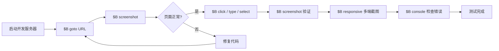
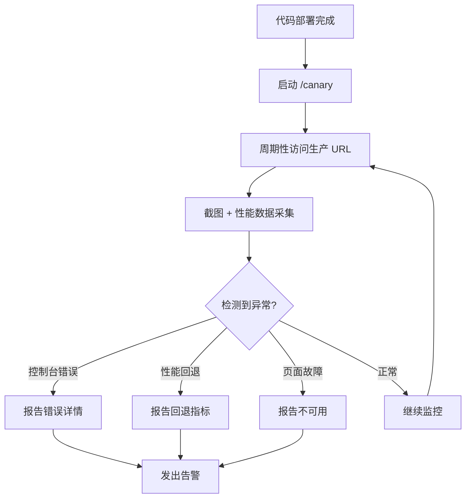

# 浏览器测试技能详解

Claude Code 内置了一套强大的浏览器测试技能，基于持久化的无头 Chromium 浏览器守护进程，每条命令响应时间约 **100ms**。本文将深入介绍 `/browse`、`/setup-browser-cookies`、`/benchmark` 和 `/canary` 四个核心技能的使用方法。

## 整体工作流



## `/browse` — 核心浏览器技能

`/browse` 是所有浏览器测试的基础。它启动一个持久化的 Chromium 守护进程，通过 `$B` 前缀命令与之交互。浏览器会话在整个会话期间保持活跃，无需反复启动。

### 完整命令参考

| 命令 | 用途 | 示例 |
|------|------|------|
| `$B goto <url>` | 导航到指定 URL | `$B goto http://localhost:3000` |
| `$B screenshot` | 截取当前页面截图 | `$B screenshot` |
| `$B click <selector>` | 点击页面元素 | `$B click button.submit` |
| `$B text <selector>` | 获取元素文本内容 | `$B text h1.title` |
| `$B console` | 查看控制台日志和错误 | `$B console` |
| `$B responsive` | 生成多设备截图 | `$B responsive` |
| `$B snapshot` | 获取页面 DOM 快照 | `$B snapshot` |
| `$B viewport <width> <height>` | 设置视口尺寸 | `$B viewport 1920 1080` |
| `$B js <expression>` | 执行 JavaScript 表达式 | `$B js document.title` |
| `$B scroll <direction>` | 滚动页面 | `$B scroll down` |
| `$B type <selector> <text>` | 在输入框中输入文本 | `$B type input.search "hello"` |
| `$B select <selector> <value>` | 选择下拉选项 | `$B select select.lang "zh"` |
| `$B hover <selector>` | 鼠标悬停在元素上 | `$B hover nav.menu` |
| `$B wait <selector>` | 等待元素出现 | `$B wait .loading-done` |

### 实战示例：测试登录流程

以下是一个完整的登录页面测试流程：

```bash
# 1. 导航到登录页
$B goto http://localhost:3000/login

# 2. 截图确认页面加载正常
$B screenshot

# 3. 输入用户名和密码
$B type input[name="email"] "test@example.com"
$B type input[name="password"] "password123"

# 4. 点击登录按钮
$B click button[type="submit"]

# 5. 等待跳转完成
$B wait .dashboard

# 6. 截图验证登录成功
$B screenshot

# 7. 检查控制台是否有错误
$B console
```

### 实战示例：表单验证测试

```bash
# 1. 导航到注册页
$B goto http://localhost:3000/register

# 2. 直接点击提交，触发验证
$B click button[type="submit"]
$B screenshot

# 3. 获取错误提示文本
$B text .error-message

# 4. 填入无效邮箱
$B type input[name="email"] "not-an-email"
$B click button[type="submit"]

# 5. 截图查看验证状态
$B screenshot
```

### 响应式测试

`$B responsive` 命令会自动生成三种设备尺寸的截图：

| 设备类型 | 视口宽度 | 用途 |
|---------|---------|------|
| Mobile | 375px | 手机端布局 |
| Tablet | 768px | 平板端布局 |
| Desktop | 1440px | 桌面端布局 |

```bash
# 一键生成三端截图
$B goto http://localhost:3000
$B responsive
```

::: tip 手动控制视口
如果需要测试特定设备尺寸，可以用 `$B viewport` 手动设置：
```bash
$B viewport 390 844   # iPhone 14 Pro
$B screenshot
$B viewport 1024 768  # iPad 横屏
$B screenshot
```
:::

### 使用 `$B js` 执行高级检查

`$B js` 可以在页面上下文中执行任意 JavaScript，非常适合做深度检查：

```bash
# 检查页面性能指标
$B js performance.timing.loadEventEnd - performance.timing.navigationStart

# 检查是否存在无障碍问题
$B js document.querySelectorAll('img:not([alt])').length

# 获取所有外部链接
$B js [...document.querySelectorAll('a[href^="http"]')].map(a => a.href)

# 检查 localStorage 数据
$B js JSON.stringify(localStorage)
```

::: warning 注意
`$B js` 的表达式在浏览器上下文中执行，不是在 Node.js 环境中。可以访问 `document`、`window` 等浏览器 API，但不能访问文件系统。
:::

---

## `/setup-browser-cookies` — Cookie 导入

在测试需要登录的页面时，每次手动输入账号密码非常繁琐。`/setup-browser-cookies` 可以从你的真实浏览器中导入 Cookie，让无头浏览器直接以登录状态访问页面。

### 使用方法

```
/setup-browser-cookies
```

执行后会弹出一个交互式选择器界面：

1. **扫描本地浏览器** — 自动检测已安装的 Chromium 系浏览器
2. **列出 Cookie 域名** — 显示所有可用的 Cookie 域名列表
3. **选择要导入的域名** — 勾选需要的域名（如 `github.com`、`your-app.com`）
4. **导入完成** — Cookie 注入到无头浏览器会话中

::: tip 典型使用场景
在运行 `/qa` 测试需要登录的页面前，先执行 `/setup-browser-cookies` 导入相关域名的 Cookie。这样 QA 测试可以直接访问需要认证的页面。
:::

### 注意事项

- 仅支持 Chromium 内核浏览器（Chrome、Edge、Brave 等）
- Cookie 在当前会话有效，新会话需要重新导入
- 不会修改你的真实浏览器 Cookie

---

## `/benchmark` — 性能基准测试

`/benchmark` 用于建立页面性能基线，并在后续 PR 中进行前后对比，检测性能回退。

### 核心功能

| 功能 | 说明 |
|------|------|
| 加载时间基线 | 测量页面首次加载时间 |
| Core Web Vitals | LCP、FID、CLS 三大指标 |
| 资源体积 | JS/CSS/图片等资源大小 |
| 前后对比 | 在 PR 中对比修改前后的性能数据 |

### 使用示例

```bash
# 建立性能基线
/benchmark

# 在 PR 中运行，自动与基线对比
/benchmark --compare
```

### 检测项目

- **Largest Contentful Paint (LCP)** — 最大内容绘制时间，衡量加载性能
- **First Input Delay (FID)** — 首次输入延迟，衡量交互性
- **Cumulative Layout Shift (CLS)** — 累积布局偏移，衡量视觉稳定性
- **Total Bundle Size** — JS 和 CSS 总包体积
- **请求数量** — 页面加载的总请求数

::: tip 在 CI 中使用
可以在 PR 流程中自动运行 `/benchmark`，当性能指标超过阈值时标记警告，防止性能回退被意外合并。
:::

---

## `/canary` — 金丝雀监控

`/canary` 用于部署后的持续监控，自动检测线上环境的异常情况。

### 监控内容

| 检测项 | 说明 |
|--------|------|
| 控制台错误 | 捕获 `console.error` 和未处理异常 |
| 性能回退 | 与部署前基线对比 Core Web Vitals |
| 页面可用性 | 检测页面是否正常加载 |
| 截图对比 | 周期性截图并与基线对比 |

### 工作流程



### 使用方式

```bash
# 部署后启动金丝雀监控
/canary

# 指定监控的生产 URL
/canary https://your-app.com
```

### 监控报告示例

当检测到异常时，`/canary` 会输出结构化报告：

```
Canary Report — https://your-app.com
================================================
Status:     ALERT
Timestamp:  2024-03-15 14:32:00 UTC

Issues Found:
  - Console Error: "TypeError: Cannot read property 'map' of undefined"
    at main.js:1234
  - LCP regression: 3.2s → 4.8s (+50%)
  - CLS regression: 0.05 → 0.18 (exceeds threshold)

Screenshots:
  - Before: baseline-home.png
  - After:  canary-home.png
```

::: warning 前置条件
使用 `/canary` 前，建议先用 `/benchmark` 建立性能基线，这样可以更准确地检测性能回退。也可以先用 `/setup-deploy` 配置部署信息。
:::

---

## 技能组合最佳实践

以下是一个完整的开发测试工作流，展示了各技能如何协同工作：

```
1. /setup-browser-cookies     ← 导入登录态 Cookie
2. /browse                     ← 手动浏览测试
   $B goto http://localhost:3000
   $B responsive
3. /benchmark                  ← 建立性能基线
4. 编写代码、提交 PR
5. /benchmark --compare        ← 对比性能变化
6. 部署上线
7. /canary                     ← 部署后监控
```

::: tip 记住关键点
- `$B` 命令响应极快（~100ms），可以大量使用
- `$B responsive` 是快速检查多端布局的最佳方式
- 先 `/setup-browser-cookies` 再做需要登录的测试
- `/benchmark` 在 PR 前后各跑一次，防止性能回退
- `/canary` 是部署后的安全网
:::
