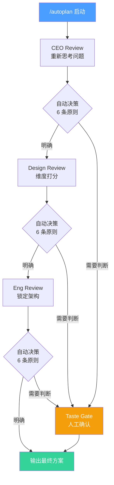

# 规划与设计技能详解

Claude Code 的规划类技能帮助你在写第一行代码之前，**想清楚要做什么、怎么做、做到什么程度**。本篇深入介绍 6 个规划与设计相关的 Skill，以及它们之间的协作关系。

## 技能总览

| 技能 | 角色 | 核心能力 | 适用阶段 |
|------|------|---------|---------|
| `/office-hours` | 头脑风暴教练 | 灵魂拷问 / 设计思维 | 想法萌芽期 |
| `/autoplan` | 自动审查总管 | 串联三重审查 + 自动决策 | 方案成型后 |
| `/plan-ceo-review` | CEO / 创始人 | 重新定义问题、扩展范围 | 方案审查 |
| `/plan-eng-review` | 工程经理 | 架构、性能、边界条件 | 方案审查 |
| `/plan-design-review` | 设计师 | 维度打分、视觉完整度 | 方案审查 |
| `/design-consultation` | 设计顾问 | 完整设计系统输出 | 项目启动 / 重构 UI |

---

## `/office-hours` — YC 式头脑风暴

灵感来自 Y Combinator 的 Office Hours 模式：用尖锐的问题帮你**看清自己在做什么**。

### Startup 模式

适合你在认真做一个产品时使用。Claude 会依次抛出 6 个 forcing questions：

| # | 维度 | 核心问题 |
|---|------|---------|
| 1 | Demand Reality | 有人在**主动寻找**你要做的东西吗？证据是什么？ |
| 2 | Status Quo | 用户现在怎么解决这个问题？为什么他们愿意换？ |
| 3 | Desperate Specificity | 谁会**急切地**需要你的产品？能具体到一个人吗？ |
| 4 | Narrowest Wedge | 你能把切入点**再缩小一半**吗？ |
| 5 | Observation | 你亲眼看到过用户遇到这个问题吗？ |
| 6 | Future-fit | 3 年后这个方向还成立吗？技术趋势怎么看？ |

```bash
/office-hours
# 选择 Startup 模式
# Claude 会逐个追问，不接受模糊回答
```

::: tip 什么时候用 Startup 模式
- 你打算投入 3 个月以上做一个产品
- 你需要说服自己（或他人）这件事值得做
- 你在多个想法之间犹豫不决
:::

### Builder 模式

适合个人项目、Hackathon、周末实验。不再是灵魂拷问，而是 **Design Thinking** 流程：

1. **共情** — 理解目标用户
2. **定义** — 明确核心问题
3. **构思** — 发散解决方案
4. **原型** — 最小可行方案
5. **测试** — 如何验证

```bash
/office-hours
# 选择 Builder 模式
# Claude 会引导你走完设计思维五步法
```

::: info Startup vs Builder 怎么选
- 有商业化意图 → Startup 模式
- 学习 / 探索 / 好玩 → Builder 模式
- 不确定 → 先 Builder，感觉靠谱了再 Startup
:::

---

## `/autoplan` — 自动审查流水线

这是规划技能中最强大的一个。它把 CEO Review、Design Review、Eng Review **串联成流水线**，大部分决策自动完成，只在关键节点要求你确认。

### 执行流程



### 6 条自动决策原则

`/autoplan` 在遇到需要做决定的地方时，会按以下原则自动判断：

| # | 原则 | 说明 |
|---|------|------|
| 1 | 用户明确偏好 | 如果用户之前表达过偏好，直接采用 |
| 2 | 行业最佳实践 | 有公认的最佳做法就选最佳做法 |
| 3 | 简单优于复杂 | 两个方案差不多时，选更简单的 |
| 4 | 可逆优于不可逆 | 优先选择容易回退的方案 |
| 5 | 数据驱动 | 有数据支撑的选择优先 |
| 6 | 一致性 | 与项目现有模式保持一致 |

当以上原则无法给出明确答案时（比如"两种 UI 风格都说得通"），`/autoplan` 会把这些 **taste decisions** 收集起来，在最后的 Approval Gate 一次性问你。

### 使用示例

```bash
# 先用 /plan 写好初始方案
/plan 实现一个支持拖拽排序的看板组件

# 然后用 /autoplan 自动走审查流水线
/autoplan

# Claude 会依次执行：
# 1. CEO Review  — 这个看板真的需要吗？范围合适吗？
# 2. Design Review — 拖拽体验评分、响应式方案评分...
# 3. Eng Review  — 用什么拖拽库？状态管理方案？
# 4. 收集 taste decisions，一次性问你
# 5. 输出最终方案
```

::: warning 注意
`/autoplan` 需要先有一个初始方案（通过 `/plan` 或手动编写）。它是审查流程，不是从零生成方案。
:::

---

## `/plan-ceo-review` — CEO 视角审查

从创始人 / 产品负责人的角度审视你的方案：**不是在你的方案上修修补补，而是重新思考问题本身**。

### 4 种审查模式

| 模式 | 触发条件 | 行为 |
|------|---------|------|
| SCOPE EXPANSION | 方案太保守、可以做更大 | 大胆扩展范围，追求 10 星产品 |
| SELECTIVE EXPANSION | 主体范围合理，局部可以更好 | 保持主体 + 挑选几个点扩展 |
| HOLD SCOPE | 范围刚好 | 确认范围，深入细节 |
| SCOPE REDUCTION | 方案太大、不现实 | 砍掉非核心功能，聚焦 MVP |

### 核心审查动作

1. **Rethink the problem** — 你确定问题定义对了吗？
2. **Find the 10-star product** — 如果没有任何限制，理想方案长什么样？
3. **Challenge premises** — 哪些"显而易见"的假设其实可以被推翻？
4. **Scope decision** — 基于以上思考，选择合适的范围模式

```bash
/plan-ceo-review
# Claude 会进入 CEO 模式，逐一追问
# 这是交互式的 — 你需要回答问题，不是被动等结果
```

::: tip 什么时候单独用 CEO Review
- 你觉得方案"对但不够好"
- 你在犹豫要不要做更大 / 更小
- 你想挑战自己的假设
:::

---

## `/plan-eng-review` — 工程经理视角审查

锁定执行方案。不再讨论"要不要做"，而是确保**能做好**。

### 审查维度

| 维度 | 关注点 |
|------|--------|
| Architecture | 模块划分、依赖关系、扩展性 |
| Data Flow | 状态管理、数据流向、缓存策略 |
| Edge Cases | 并发、空值、超时、重试、幂等 |
| Test Coverage | 单元测试、集成测试、E2E 测试策略 |
| Performance | 加载时间、内存、N+1 查询、bundle size |

### 审查风格

Eng Review 是**强观点**的 — 不会给你列一堆选项让你选，而是直接告诉你：

```
架构建议：用 zustand 管理看板状态，不要用 Redux。
原因：看板状态是局部的，zustand 的 slice 模式刚好匹配，Redux 在这里过度设计。
如果你不同意，说明你的理由。
```

```bash
/plan-eng-review
# Claude 会逐个维度审查，给出明确建议
# 你可以反驳，它会认真考虑后坚持或修改
```

::: info Eng Review 的态度
它不是随和的——如果你的方案有问题，它会直说。但如果你给出合理的理由，它也会接受。这正是好的工程审查应有的样子。
:::

---

## `/plan-design-review` — 设计师视角审查

从设计专业角度审查方案中与用户体验相关的部分。

### 打分机制

Design Review 会对每个设计维度进行 0-10 打分：

```
信息架构: 7/10
  当前: 三级嵌套导航，用户需要 3 次点击到达目标
  10 分: 扁平化导航 + 全局搜索，最多 1 次点击
  修改: 将二级菜单改为标签页，去掉三级

视觉层级: 5/10
  当前: 所有元素视觉权重接近，没有明确焦点
  10 分: 清晰的 F 型阅读动线，CTA 按钮突出
  修改: 增大标题字号对比，CTA 使用主色调
```

### 审查维度示例

- 信息架构（Information Architecture）
- 视觉层级（Visual Hierarchy）
- 交互模式（Interaction Patterns）
- 响应式设计（Responsive Design）
- 可访问性（Accessibility）
- 微交互与动效（Micro-interactions）
- 一致性（Consistency）

```bash
/plan-design-review
# Claude 会进入设计师模式
# 对每个维度打分 → 解释 10 分标准 → 给出修改建议
```

::: tip Design Review vs Design Consultation
- **Design Review** — 审查已有方案中的设计部分（在 plan mode 中工作）
- **Design Consultation** — 从零开始建立完整设计系统（独立流程）
:::

---

## `/design-consultation` — 设计咨询

这不是审查，而是一个完整的设计咨询流程。适合项目从零开始或 UI 大改版。

### 咨询流程


1. **Product Understanding** — Claude 会深入了解你的产品定位、目标用户、核心场景
2. **Landscape Research** — 研究同类产品的设计模式，找到差异化机会
3. **Complete Design System** — 输出完整设计系统：
   - 美学风格（Aesthetic Direction）
   - 字体方案（Typography Scale）
   - 配色系统（Color Palette）
   - 布局网格（Layout Grid）
   - 间距系统（Spacing Scale）
   - 动效规范（Motion Guidelines）
4. **Preview Pages** — 生成字体 + 配色的预览页面，让你直观感受
5. **DESIGN.md** — 输出结构化的设计文档，作为项目的设计规范

```bash
/design-consultation
# Claude 会引导你走完整个咨询流程
# 最终产出 DESIGN.md 和预览页面
```

::: warning 耗时提醒
完整的 Design Consultation 需要较多交互，通常需要 15-30 分钟。如果你只是想快速审查方案中的设计部分，用 `/plan-design-review` 更合适。
:::

---

## 三种 Review 对比

| 维度 | CEO Review | Eng Review | Design Review |
|------|-----------|-----------|--------------|
| 核心问题 | 做不做？做多大？ | 能不能做好？ | 用户体验好不好？ |
| 思维方式 | 发散 → 收敛 | 收敛 → 锁定 | 评分 → 提升 |
| 决策风格 | 挑战假设 | 强观点建议 | 维度打分 |
| 可能的结果 | 扩大/缩小范围 | 修改架构/技术选型 | 改善 UX 细节 |
| 交互方式 | 追问式对话 | 逐维度审查 | 打分 + 解释 |
| 适合场景 | 方向不确定 | 方案已定，锁定细节 | UI/UX 相关方案 |

---

## 实战工作流

### 场景：从零做一个 SaaS 产品

```bash
# Step 1: 头脑风暴 — 确认这件事值得做
/office-hours
# 选 Startup 模式，回答 6 个灵魂拷问

# Step 2: 设计咨询 — 确定设计方向
/design-consultation
# 走完咨询流程，拿到 DESIGN.md

# Step 3: 写初始方案
/plan 基于 DESIGN.md 实现用户注册和仪表盘页面

# Step 4: 自动审查流水线
/autoplan
# CEO → Design → Eng 依次审查
# 在 Approval Gate 确认 taste decisions

# Step 5: 开始实施
# 方案已经过三重审查，可以放心写代码了
```

### 场景：给现有项目加新功能

```bash
# Step 1: 写方案
/plan 给博客系统添加评论功能，支持嵌套回复和 @提及

# Step 2: 快速审查（选一个或多个）
/plan-ceo-review    # 范围合适吗？
/plan-eng-review    # 架构可行吗？

# 或者一键走完全部
/autoplan
```

---

## 最佳实践

1. **先有方案再审查** — `/autoplan` 和三种 review 都需要先有一个初始方案
2. **不用每次都走全流程** — 小功能直接 `/plan-eng-review` 就够了
3. **认真回答追问** — 这些 review 是交互式的，你的回答质量决定审查质量
4. **善用 `/office-hours`** — 在最早期用，比写完方案再推翻成本低得多
5. **DESIGN.md 是资产** — `/design-consultation` 产出的文档应该被版本控制

---

上一篇：[Skills 自定义命令 ←](/zh/features/skills) | 下一篇：[发布与部署技能详解 →](/zh/features/skills-shipping)
