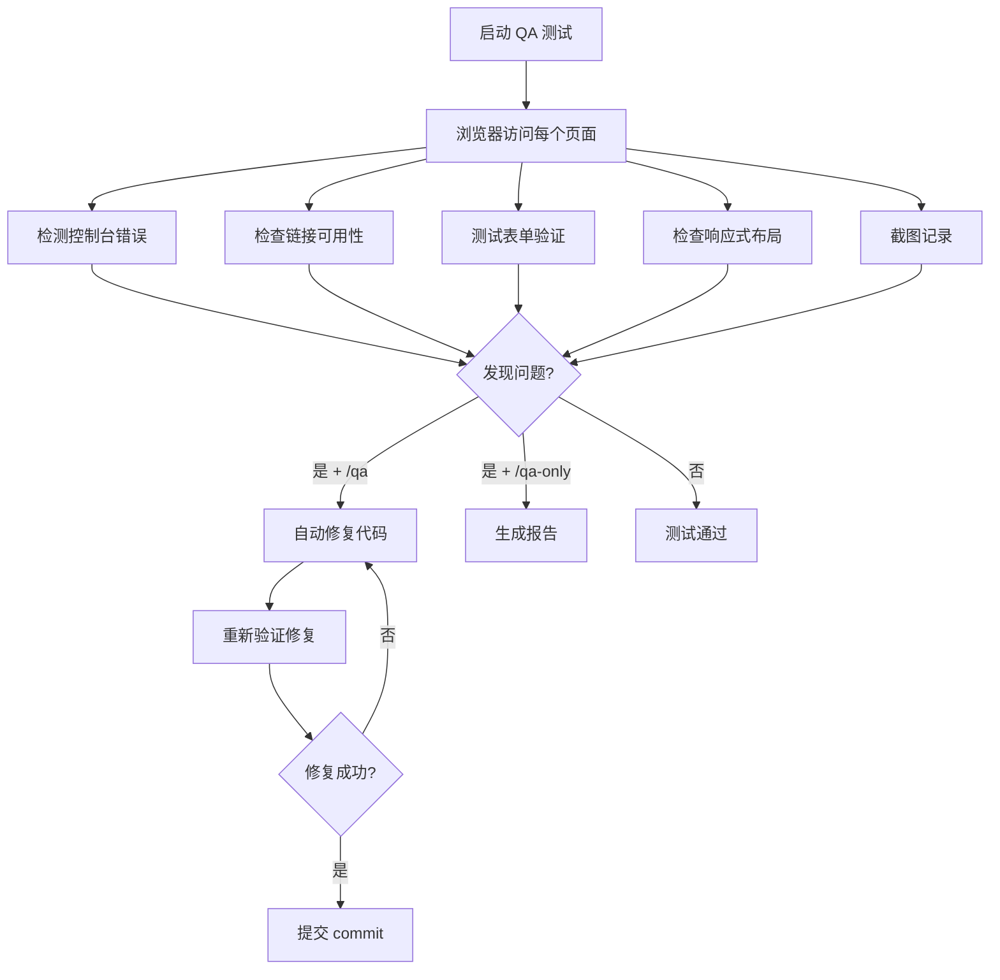

# QA 自动测试技能详解

Claude Code 提供了三个 QA 相关技能：`/qa`（自动测试并修复）、`/qa-only`（仅报告不修复）和 `/design-review`（设计审查）。它们基于内置的无头浏览器自动遍历你的 Web 应用，发现问题并生成报告。

## QA 工作流概览



---

## `/qa` — 自动 QA + 修复

`/qa` 是最强大的 QA 技能。它不仅能发现问题，还会自动修改源代码修复 bug，逐个提交，并重新验证。

### 三个测试层级

| 层级 | 名称 | 覆盖范围 | 适用场景 |
|------|------|---------|---------|
| Quick | 快速测试 | 主要页面 + 控制台错误 + 关键链接 | 快速 smoke test |
| Standard | 标准测试 | 所有页面 + 表单 + 响应式 + 链接 | 日常开发 |
| Exhaustive | 详尽测试 | 全量页面 + 边界情况 + 多浏览器尺寸 + 深度交互 | 发版前 |

### 检测项目

`/qa` 会自动检查以下内容：

- **控制台错误** — `console.error`、未处理的 Promise rejection、JavaScript 异常
- **链接可用性** — 404 链接、死链、外部链接超时
- **视觉问题** — 元素溢出、文本截断、图片加载失败
- **表单验证** — 必填字段、输入格式、提交行为
- **响应式布局** — 移动端/平板/桌面端的布局是否正常
- **无障碍基础** — 图片 alt 属性、表单 label 关联

### 工作原理

```
/qa
```

执行流程：

1. **发现页面** — 从入口 URL 开始，自动爬取所有可达页面
2. **逐页测试** — 对每个页面执行全套检测
3. **记录问题** — 截图 + 控制台日志 + DOM 快照
4. **修复代码** — 定位问题根因，修改源代码
5. **重新验证** — 刷新页面确认修复生效
6. **原子提交** — 每个修复单独 commit，便于回退

### 实战示例

假设你有一个 Next.js 应用运行在 `localhost:3000`：

```
> /qa

QA Testing — http://localhost:3000
============================================

Scanning pages...
  Found 12 pages to test

Testing /home ... 
  PASS - No issues

Testing /dashboard ...
  FAIL - Console error: "TypeError: data.map is not a function"
  → Fix: Added null check in DashboardTable.tsx:42
  → Verified: Error resolved
  → Committed: "fix: add null check for dashboard data"

Testing /settings ...
  FAIL - Form submit button disabled state not updating
  → Fix: Updated useForm hook in SettingsForm.tsx:28
  → Verified: Button state correct
  → Committed: "fix: settings form submit button state"

Testing /profile ...
  FAIL - Image overflow on mobile (375px)
  → Fix: Added max-width: 100% to Avatar component
  → Verified: No overflow
  → Committed: "fix: avatar image responsive overflow"

Summary: 12 pages tested, 3 issues fixed, 3 commits created
```

::: tip 何时使用 /qa
- 功能开发完成后，提交 PR 前
- 合并他人代码后的回归测试
- 作为 CI 流程的一部分自动执行
:::

---

## `/qa-only` — 仅报告不修复

`/qa-only` 执行与 `/qa` 完全相同的测试流程，但不会修改任何代码。它只生成一份结构化的报告，适合需要人工审查后再决定修复方案的场景。

### 报告格式

```
QA Report — http://localhost:3000
============================================
Health Score: 7.5 / 10

Critical (1):
  Page: /dashboard
  Issue: Console error - TypeError: data.map is not a function
  Screenshot: qa-dashboard-error.png
  Repro: Navigate to /dashboard without data

Warning (2):
  Page: /settings
  Issue: Form validation - submit button remains enabled with invalid input
  Screenshot: qa-settings-form.png
  Repro: Clear required fields → observe button state

  Page: /profile
  Issue: Responsive - avatar image overflows container at 375px
  Screenshot: qa-profile-mobile.png
  Repro: Set viewport to 375px → check avatar area

Info (1):
  Page: /about
  Issue: External link to docs.example.com returns 301 redirect
  Repro: Click "Documentation" link in footer
```

### 报告要素

| 字段 | 说明 |
|------|------|
| Health Score | 0-10 分，综合评估站点健康状态 |
| 严重程度分级 | Critical / Warning / Info 三级 |
| 截图 | 每个问题附带截图证据 |
| 复现步骤 | 精确的 Repro Steps，方便手动验证 |

::: tip 适用场景
- 团队协作时，先生成报告分配给对应开发者
- 不确定是否应该自动修复时，先看报告再决定
- 用作 code review 的辅助材料
:::

---

## `/design-review` — 设计审查

`/design-review` 关注的不是功能 bug，而是**视觉和交互质量**。它以设计师的眼光审视页面，找出间距不一致、层级混乱、AI 生成痕迹等问题，然后迭代修复。

### 检测项目

| 类别 | 检测内容 |
|------|---------|
| 间距一致性 | 相似元素间的 margin/padding 是否统一 |
| 视觉层级 | 标题、正文、辅助文字的大小和权重是否合理 |
| AI Slop 模式 | 检测明显的 AI 生成痕迹：过度使用渐变、不必要的阴影、通用占位文案 |
| 交互响应 | hover 状态、过渡动画、加载反馈是否流畅 |
| 颜色一致性 | 是否使用了设计系统之外的颜色值 |
| 排版细节 | 行高、字间距、文本对齐等排版规范 |

### 工作流程

```
/design-review
```

执行流程：

1. **截图基线** — 对每个页面截取 Before 截图
2. **逐项审查** — 检查间距、层级、配色、交互等
3. **修复代码** — 调整 CSS/组件样式
4. **截图对比** — 截取 After 截图，与 Before 对比
5. **迭代优化** — 如果仍有问题，继续修复
6. **提交变更** — 每轮修复原子提交

### Before/After 对比

`/design-review` 的核心价值在于 Before/After 截图对比。每次修复后，你可以直观地看到改进效果：

```
Design Review — /pricing
=========================

Issue: Card spacing inconsistent (24px vs 16px vs 32px)
  Before: review-pricing-before.png
  Fix: Unified card gap to 24px
  After: review-pricing-after.png

Issue: CTA button too small for touch target
  Before: review-cta-before.png
  Fix: Increased button padding, min-height 44px
  After: review-cta-after.png

Issue: AI slop — gratuitous gradient on section background
  Before: review-gradient-before.png
  Fix: Replaced with solid background color from design tokens
  After: review-gradient-after.png
```

::: warning AI Slop 检测
`/design-review` 特别擅长检测 AI 辅助生成的代码中常见的"过度设计"问题：多余的渐变、不必要的动画、过度的圆角和阴影。这些模式会让页面看起来很"AI"，降低专业感。
:::

---

## 三个技能对比

| 特性 | `/qa` | `/qa-only` | `/design-review` |
|------|-------|-----------|-----------------|
| 测试范围 | 功能 + 链接 + 表单 + 响应式 | 同 `/qa` | 视觉 + 间距 + 层级 + 交互 |
| 自动修复 | 是 | 否 | 是 |
| 输出物 | 修复 commit | 结构化报告 | 修复 commit + Before/After 截图 |
| 适用阶段 | 开发中 / PR 前 | 评审 / 分配任务 | 设计稿对比 / 上线前打磨 |
| 关注点 | 功能正确性 | 功能正确性 | 视觉质量 |
| 修改代码 | 是 | 否 | 是 |

### 推荐工作流

```
1. /qa-only              ← 先看报告，了解问题全貌
2. /qa                   ← 自动修复功能性 bug
3. /design-review        ← 打磨视觉细节
4. /qa-only              ← 最终确认，确保没有回退
```

::: tip 组合使用建议
- **日常开发**：`/qa` 快速修复 → `/design-review` 打磨细节
- **发版前**：`/qa-only` 生成报告 → 人工评审 → `/qa` 修复 → `/design-review` 最终打磨
- **Code Review**：`/qa-only` 报告作为 Review 材料，帮助 Reviewer 了解现状
:::
