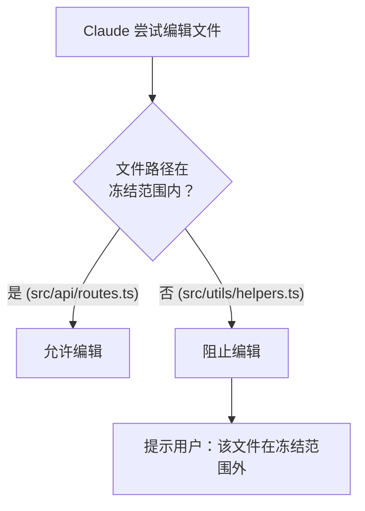
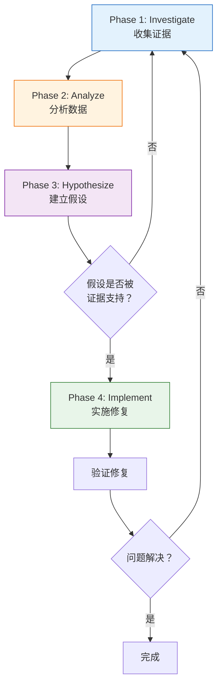

# 安全与调试技能详解

Claude Code 提供了一套完整的**安全防护**和**系统化调试**技能，帮助你在操作生产环境、调试复杂 bug 时保持安全和高效。本文将深入讲解 `/careful`、`/freeze`、`/unfreeze`、`/guard`、`/cso` 和 `/investigate` 六个核心技能。

## 安全等级一览

在开始之前，先了解各安全技能的防护级别：

| 技能 | 命令拦截 | 编辑范围限制 | 审计扫描 | 适用场景 |
|------|----------|-------------|----------|---------|
| `/careful` | :white_check_mark: | :x: | :x: | 日常开发，防止误执行危险命令 |
| `/freeze` | :x: | :white_check_mark: | :x: | 聚焦开发，限制编辑范围 |
| `/guard` | :white_check_mark: | :white_check_mark: | :x: | 生产操作，最大化安全 |
| `/cso` | :x: | :x: | :white_check_mark: | 发布前安全审计 |

::: tip 快速选择
- 日常开发 → `/careful`
- 调试某个模块 → `/freeze`
- 操作生产环境 → `/guard`
- 重要发布前 → `/cso`
- 遇到诡异 bug → `/investigate`
:::

---

## `/careful` — 危险命令警告

`/careful` 是最基础的安全防护层。启用后，Claude Code 在执行**破坏性命令**前会弹出警告，让你确认后才继续。

### 它能拦截哪些命令？

| 类别 | 命令示例 | 危险程度 |
|------|---------|---------|
| 文件删除 | `rm -rf /`, `rm -rf *` | 极高 |
| 数据库操作 | `DROP TABLE users`, `DELETE FROM` 无 WHERE | 极高 |
| Git 强制操作 | `git push --force`, `git reset --hard` | 高 |
| 容器清理 | `docker rm -f`, `docker system prune` | 高 |
| K8s 删除 | `kubectl delete namespace`, `kubectl delete pod` | 高 |
| 权限变更 | `chmod 777`, `chown -R` | 中 |

### 使用方式

```bash
/careful
# 启用后所有后续操作都会受到保护
```

启用后的交互示例：

```
You: 清理一下旧的构建文件
Claude: 我需要执行 rm -rf dist/ build/

  ⚠️ 危险命令警告
  命令: rm -rf dist/ build/
  风险: 递归删除目录，不可恢复
  
  确认执行？[y/N]
```

### 什么时候该用 `/careful`

- 在生产服务器上做任何操作
- 清理文件或数据库数据
- 执行 Git 历史重写操作
- 操作 Kubernetes 集群资源

::: warning 注意
`/careful` 只拦截**命令执行**，不限制文件编辑。如果你还需要限制编辑范围，请使用 `/guard`。
:::

---

## `/freeze` — 冻结编辑范围

`/freeze` 限制 Claude Code 的**文件编辑能力**，只允许修改指定目录下的文件。所有 `Edit` 和 `Write` 工具调用如果目标路径不在允许范围内，都会被阻止。

### 使用方式

```bash
/freeze src/api/
# 之后只有 src/api/ 下的文件可以被编辑
```

### 工作原理



### 实战场景

**场景 1：只修改 API 层**

```bash
/freeze src/api/
# 现在调试 API 时不会误改前端代码
```

**场景 2：只修改某个组件**

```bash
/freeze src/components/UserProfile/
# 聚焦在用户资料组件，不影响其他组件
```

**场景 3：只修改配置文件**

```bash
/freeze config/
# 安全地调整配置，不会碰到业务代码
```

### 为什么需要 `/freeze`

调试时经常会出现"蝴蝶效应"——修一个 bug 时不小心改了不相关的代码，引入新问题。`/freeze` 通过物理隔离避免这种情况：

- 防止调试时误修改其他模块
- 保证 PR 的改动范围干净
- 新手可以安全地在限定范围内操作

---

## `/unfreeze` — 解除冻结

清除 `/freeze` 设置的限制，恢复对所有目录的编辑权限。

```bash
/unfreeze
# 编辑范围恢复为全部目录
```

::: tip 小贴士
`/freeze` 和 `/unfreeze` 可以在一个会话中多次切换。比如先冻结在 API 层修复 bug，解冻后再去修改对应的测试文件。
:::

---

## `/guard` — 完全安全模式

`/guard` 是 `/careful` + `/freeze` 的组合，同时启用命令拦截和编辑范围限制，提供**最高安全等级**。

### 使用方式

```bash
/guard src/
# 等同于同时启用：
# /careful — 拦截危险命令
# /freeze src/ — 限制编辑范围到 src/
```

### 适用场景

| 场景 | 为什么用 `/guard` |
|------|------------------|
| 修复生产 bug | 既要防误操作，又要限定修改范围 |
| 新人 onboarding | 在安全环境下学习代码库 |
| Code Review 后修改 | 确保只改 reviewer 指出的文件 |
| 敏感数据操作 | 最大化安全，防止数据泄露 |

### `/guard` vs 单独使用

```
           命令安全    编辑安全    综合安全
/careful   ████████    --------    ████----
/freeze    --------    ████████    ----████
/guard     ████████    ████████    ████████
```

---

## `/cso` — 首席安全官审计

`/cso`（Chief Security Officer）是一个深度安全审计技能，不是简单的静态分析——它会**主动验证**，实际运行测试而不只是扫描代码。

### 两种审计模式

| 模式 | 触发条件 | 置信度门槛 | 深度 |
|------|---------|-----------|------|
| Daily | 日常快速审计 | 8/10 | 重点检查高风险区域 |
| Monthly | 月度全面审计 | 无门槛（全面扫描） | 覆盖所有审计领域 |

### 审计领域

`/cso` 覆盖以下七大安全领域：

#### 1. Secrets 考古

扫描整个 Git 历史（不只是当前代码），寻找泄露的密钥、Token、密码：

```
- .env 文件是否被误提交过
- Git 历史中是否有 API Key 残留
- 硬编码的密码或连接字符串
- Base64 编码的凭据
```

#### 2. 依赖供应链

检查第三方依赖的安全性：

```
- 已知漏洞（CVE）检查
- 依赖是否被弃用或劫持
- 锁文件完整性验证
- 异常的 postinstall 脚本
```

#### 3. CI/CD 管道安全

审计构建和部署流程：

```
- GitHub Actions workflow 注入风险
- Secret 传递链是否安全
- 构建产物是否可被篡改
- 部署权限是否最小化
```

#### 4. LLM/AI 安全

如果项目涉及 LLM 集成：

```
- Prompt 注入防护
- 用户输入是否经过清洗
- LLM 输出是否被盲信执行
- API Key 暴露风险
```

#### 5. Skill 供应链

检查已安装的 Claude Code 技能：

```
- 技能来源可信度
- 技能权限是否过大
- 是否有恶意指令
```

#### 6. OWASP Top 10

经典 Web 安全检查：注入、认证绕过、XSS、CSRF、配置错误等。

#### 7. STRIDE 威胁建模

从六个维度系统评估威胁：

| 维度 | 英文 | 检查内容 |
|------|------|---------|
| 欺骗 | Spoofing | 身份伪造风险 |
| 篡改 | Tampering | 数据完整性风险 |
| 抵赖 | Repudiation | 审计日志完整性 |
| 泄露 | Information Disclosure | 敏感信息暴露 |
| 拒绝服务 | Denial of Service | 资源耗尽风险 |
| 提权 | Elevation of Privilege | 权限升级风险 |

### 使用建议

```bash
# 日常快速审计（推荐每周运行）
/cso
# 选择 Daily 模式

# 月度全面审计（推荐每月或重大发布前）
/cso
# 选择 Monthly 模式
```

::: warning 耗时提醒
- Daily 模式：约 10-15 分钟
- Monthly 模式：约 20-30 分钟

Monthly 审计非常彻底，建议在不赶进度时运行。
:::

### 主动验证 vs 静态分析

`/cso` 的核心优势是**主动验证**——它不只是扫描代码模式，而是实际执行测试：

| 方法 | 静态分析工具 | `/cso` 主动验证 |
|------|-------------|----------------|
| 发现 SQL 注入 | 匹配代码模式 | 构造 payload 实际测试 |
| 检查依赖漏洞 | 比对 CVE 数据库 | 验证漏洞是否可利用 |
| 审计 Secret | 正则匹配 | 检查 Git 历史每个 commit |
| CI/CD 安全 | 检查配置文件 | 模拟攻击向量 |

---

## `/investigate` — 系统化调试

`/investigate` 是一套严格的四阶段调试方法论。它的核心原则——**铁律**——是：**不找到根本原因，绝不动手修复**。

### 四阶段调试流程



### Phase 1: Investigate（收集证据）

目标：尽可能多地收集与问题相关的信息。

```
- 复现问题，记录精确步骤
- 查看错误日志和堆栈跟踪
- 检查最近的代码变更（git log, git diff）
- 确认环境信息（Node 版本、OS、依赖版本）
- 收集相关配置文件
```

### Phase 2: Analyze（分析数据）

目标：从证据中找出模式和线索。

```
- 错误是间歇性的还是必现的？
- 什么条件下触发？什么条件下不触发？
- 最近什么改动可能引入了问题？
- 错误路径上涉及哪些组件？
```

### Phase 3: Hypothesize（建立假设）

目标：提出具体的、可验证的假设。

```
好的假设：
  "因为 UserService.getById() 在用户不存在时返回 null，
   而 ProfileController 没有 null check，导致 TypeError"

坏的假设：
  "可能是后端有 bug"
```

关键：假设必须**可验证**，而且能解释所有已知证据。

### Phase 4: Implement（实施修复）

目标：基于已验证的假设实施最小化修复。

```
- 修复范围最小化，只改必要的代码
- 编写测试覆盖修复的场景
- 验证修复后问题确实解决
- 确认没有引入新的回归
```

### `/investigate` vs 普通调试

| 方面 | 普通调试 | `/investigate` |
|------|---------|----------------|
| 方法 | 看到错误就尝试修复 | 先收集证据再分析 |
| 风险 | 可能修了表象，根因还在 | 确保找到根因 |
| 速度 | 简单问题更快 | 复杂问题更快 |
| 适用 | 一看就知道原因的 bug | 诡异的、间歇性的 bug |
| 结果 | 可能引入新 bug | 最小化修改，更安全 |

### 什么时候该用 `/investigate`

**适合 `/investigate` 的场景：**

- 间歇性出现的 bug
- 多个组件交互产生的问题
- 生产环境才出现的问题
- 修了好几次还是没解决的 bug
- 不确定根因在哪的问题

**不需要 `/investigate` 的场景：**

- 拼写错误导致的 bug
- 明显的逻辑错误
- 编译错误或类型错误
- 一眼就能看出问题的情况

### 实战示例

```bash
/investigate

# Claude 会按四阶段流程进行：

# Phase 1: 开始收集证据
# > 复现问题...
# > 检查错误日志...
# > 查看最近 commit...

# Phase 2: 分析证据
# > 错误只在并发请求时出现
# > 最近加了缓存层但没有加锁
# > 两个请求同时写缓存导致竞态条件

# Phase 3: 假设
# > "CacheService.set() 不是原子操作，并发写入时
# >  后写入的值会覆盖先写入的值，导致数据不一致"

# Phase 4: 修复
# > 为 CacheService 添加互斥锁
# > 编写并发测试验证
```

---

## 技能组合策略

不同场景下推荐的技能组合：

| 场景 | 推荐组合 | 说明 |
|------|---------|------|
| 日常开发 | `/careful` | 基础安全防护 |
| 模块聚焦开发 | `/freeze dir/` | 限制编辑范围 |
| 生产 bug 修复 | `/guard src/` + `/investigate` | 安全 + 系统调试 |
| 发布前检查 | `/cso` (Monthly) | 全面安全审计 |
| 新人上手 | `/guard src/` | 安全学习环境 |
| 紧急修复 | `/careful` + `/investigate` | 快速但安全地调试 |

---

## 总结

安全和调试技能是 Claude Code 的**护栏系统**：

- **`/careful`** — 命令级别的安全网
- **`/freeze` / `/unfreeze`** — 文件级别的安全网
- **`/guard`** — 命令 + 文件的双重安全网
- **`/cso`** — 项目级别的安全审计
- **`/investigate`** — 方法论级别的调试保障

核心理念：**安全不是束缚，而是让你可以更大胆地操作的信心来源**。在生产环境上有了 `/guard`，你反而可以更放心地调试。有了 `/investigate`，你不会因为急于修复而引入更多问题。

---

上一篇：[浏览器测试技能 ←](/zh/features/skills-browser) | 下一篇：[Superpowers 插件 →](/zh/features/skills-superpowers)
