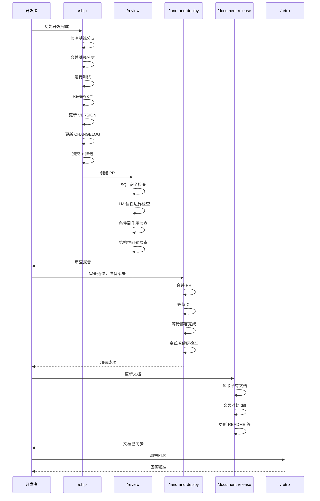

# 发布与部署技能详解

从代码完成到生产环境运行，中间有一系列流程需要走完。Claude Code 的发布类技能把这条路径**自动化成一条流水线**：发布 → 审查 → 合并部署 → 文档更新 → 回顾总结。

## 技能总览

| 技能 | 职责 | 一句话说明 |
|------|------|-----------|
| `/ship` | 发布 | 从代码到 PR 的全自动流程 |
| `/review` | 审查 | 预合并质量关卡 |
| `/land-and-deploy` | 合并部署 | 从 PR 到生产环境 |
| `/document-release` | 文档更新 | 保持文档与代码同步 |
| `/retro` | 周回顾 | 分析团队产出与代码质量 |

---

## 完整生命周期



---

## `/ship` — 一键发布

功能开发完成后，`/ship` 帮你走完从代码到 PR 的全部流程。你不需要手动切分支、跑测试、改版本号、写 CHANGELOG。

### 完整工作流

```bash
/ship
```

执行后 Claude 会自动完成以下步骤：

| 步骤 | 动作 | 说明 |
|------|------|------|
| 1 | Detect base branch | 自动识别 `main` / `master` / `develop` |
| 2 | Merge base branch | 确保你的分支是最新的，避免合并冲突 |
| 3 | Run tests | 执行项目的测试套件，失败则中止 |
| 4 | Review diff | 自动审查所有变更，检查明显问题 |
| 5 | Bump VERSION | 根据变更类型（patch / minor / major）更新版本号 |
| 6 | Update CHANGELOG | 自动生成变更日志条目 |
| 7 | Commit | 将版本号和 CHANGELOG 变更提交 |
| 8 | Push | 推送到远程分支 |
| 9 | Create PR | 创建 Pull Request，包含完整描述 |

### 版本号策略

`/ship` 会根据你的变更内容自动判断版本号：

- **patch** (0.0.x) — Bug 修复、文档更新、小调整
- **minor** (0.x.0) — 新功能、新 API（向后兼容）
- **major** (x.0.0) — 破坏性变更

如果自动判断不准确，Claude 会问你确认。

### 实际示例

```bash
# 你在 feature/kanban-drag 分支上完成了拖拽排序功能
/ship

# Claude 输出：
# ✓ Base branch detected: main
# ✓ Merged latest main (no conflicts)
# ✓ Tests passed (42 tests, 0 failures)
# ✓ Diff reviewed: 12 files changed, +380 -45
# ✓ VERSION bumped: 1.2.0 → 1.3.0 (minor: new feature)
# ✓ CHANGELOG updated
# ✓ Committed and pushed
# ✓ PR created: https://github.com/you/repo/pull/42
```

::: tip 什么时候用 /ship
- 功能开发完成，所有测试通过
- 你准备提交代码让别人 review
- 你想一次性完成"提交 → 推送 → 创建 PR"的全部流程
:::

::: warning 什么时候不要用 /ship
- 代码还没写完（用 `/commit` 做中间提交）
- 你想直接合并到 main（用 `/land-and-deploy`）
- 你只想跑测试（直接运行测试命令）
:::

---

## `/review` — 代码审查

`/review` 是一个**预合并质量关卡**。它会分析你的 diff，从多个安全和质量维度进行检查。

### 检查维度

| 维度 | 检查内容 | 严重程度 |
|------|---------|---------|
| SQL Safety | SQL 注入、未参数化查询、危险的 `DROP` / `TRUNCATE` | Critical |
| LLM Trust Boundary | 用户输入直接进入 prompt、未验证的 LLM 输出 | Critical |
| Conditional Side Effects | 条件分支中的副作用（写文件、发请求、修改状态） | Warning |
| Structural Issues | 循环依赖、过长函数、重复代码、命名不一致 | Info |

### 审查报告示例

```bash
/review

# CRITICAL [SQL Safety] src/api/users.ts:42
#   Raw string interpolation: `WHERE name = '${name}'`
#   Fix: Use parameterized query
#
# WARNING [Conditional Side Effect] src/services/order.ts:87
#   File write inside conditional block may not execute on all paths
#
# Summary: 1 critical, 1 warning — Fix before landing
```

### 与 `/ship` 的关系

`/ship` 内部会自动运行一轮 review。但你也可以**单独**运行 `/review`：

- `/ship` 的 review 是流水线的一部分，发现问题会中止流程
- 单独 `/review` 更适合自查，或者在别人的 PR 上做审查

```bash
# 审查当前分支的变更
/review

# 审查别人的 PR（需要先 checkout 对应分支）
git checkout feature/payment
/review
```

---

## `/land-and-deploy` — 合并部署

`/ship` 创建了 PR，Review 通过后，`/land-and-deploy` 接管后续流程：**合并 → 等待 CI → 等待部署 → 验证生产环境**。

### 工作流

```bash
/land-and-deploy
```

| 步骤 | 动作 | 失败处理 |
|------|------|---------|
| 1 | Merge PR | 合并冲突 → 中止并提示 |
| 2 | Wait for CI | CI 失败 → 中止并显示日志 |
| 3 | Wait for deploy | 超时 → 告警并提供排查建议 |
| 4 | Canary health check | 异常 → 建议回滚 |

### 金丝雀健康检查

部署完成后，Claude 会自动进行生产环境健康检查：

- **HTTP 状态码** — 关键页面是否返回 200
- **控制台错误** — 是否有新增的 JS 错误
- **性能指标** — 页面加载时间是否有显著退化
- **功能验证** — 核心流程是否正常（基于配置）

```bash
# 通常的工作流
/ship                    # 创建 PR
/review                  # 最终确认
/land-and-deploy         # 合并并部署

# Claude 输出：
# ✓ PR #42 merged into main
# ✓ CI passed (3m 42s)
# ✓ Deploy completed (fly.io, region: sjc)
# ✓ Health check passed:
#   - GET / → 200 (142ms)
#   - GET /api/health → 200 (38ms)
#   - Console errors: 0
#   - LCP: 1.2s (baseline: 1.1s, within threshold)
# ✓ Production is healthy. Ship it!
```

::: tip 前置配置
第一次使用 `/land-and-deploy` 前，建议先运行 `/setup-deploy` 配置部署平台、生产 URL、健康检查端点等信息。
:::

---

## `/document-release` — 文档更新

代码发布后，文档也需要同步更新。`/document-release` 会自动完成这件事。

### 工作流

1. **读取所有项目文档** — README、ARCHITECTURE、CONTRIBUTING、CLAUDE.md 等
2. **交叉对比 diff** — 找出代码变更中影响文档的部分
3. **更新文档** — 自动修改相关文档内容
4. **润色 CHANGELOG** — 统一语气和格式
5. **清理 TODOs** — 标记已完成的 TODO 项
6. **可选：更新 VERSION** — 如果 `/ship` 时漏掉了

### 更新范围

| 文档 | 更新内容 |
|------|---------|
| README.md | 新功能说明、使用方式、安装步骤 |
| ARCHITECTURE.md | 架构变更、新模块说明、数据流变化 |
| CONTRIBUTING.md | 新的开发规范、测试要求 |
| CLAUDE.md | 项目规则、新增约定 |
| CHANGELOG.md | 润色已有条目的措辞和格式 |

```bash
/document-release
# Claude 会自动读取 diff，找出需要更新的文档
# 每个修改都会说明原因
```

::: info 什么时候用
- `/ship` + `/land-and-deploy` 之后
- 大版本发布后
- 你意识到文档和代码已经不同步了
:::

---

## `/retro` — 周回顾

每周结束时运行，分析本周的工程产出。不只是看数据，还会给出**有温度的反馈**。

### 分析维度

| 维度 | 内容 |
|------|------|
| Commit History | 提交频率、分布、大小 |
| Work Patterns | 工作时间段、集中度、并行任务数 |
| Code Quality | 测试覆盖率变化、lint 问题、技术债趋势 |
| Per-person Breakdown | 每个人的贡献、亮点、成长空间 |

### 输出示例

```bash
/retro

# Claude 输出：
# Weekly Retro: W14 2026
# Commits: 47 (+12 vs last week) | Files: 128 | Test coverage: 78% → 82%
#
# @alice — Commits: 23 | Reviews: 5
#   ★ 重构认证模块，测试覆盖 60% → 95%
#   △ 部分提交改动范围过大，粒度可以更细
#
# @bob — Commits: 18 | Reviews: 8
#   ★ Review 质量高，多次发现并发问题
#   △ 建议给复杂 PR 加更多测试用例
#
# Trends (4 weeks): Velocity ▲▲▲△ | Quality ▲▲▲▲ | Tech debt △▼▼▼
```

### 持久化历史

`/retro` 会保存每次回顾结果，用于趋势追踪：速度、代码质量、技术债的变化方向。

```bash
/retro                  # 本周回顾
/retro last 2 weeks     # 指定时间范围
```

::: tip 团队使用建议
- 每周五下班前运行一次
- 把报告分享到团队频道，作为周会素材
- 关注趋势比关注单周数字更重要
:::

---

## 实战工作流串联

### 标准发布流程

```bash
/ship                   # 1. 创建 PR
/review                 # 2. 自查，修复 warning 后重新提交
/land-and-deploy        # 3. 合并部署，健康检查
/document-release       # 4. 同步文档
/retro                  # 5. 周末回顾
```

### 紧急修复流程

```bash
git checkout -b hotfix/fix-login-crash
# 修复 bug...
/ship                   # /ship 内置 review 做基本检查
/land-and-deploy        # 立即部署，金丝雀确认修复生效
/document-release       # 事后补文档
```

### 与规划技能的衔接

```bash
# 规划: /office-hours → /plan → /autoplan
# 开发: 写代码...
# 发布: /ship → /review → /land-and-deploy → /document-release
# 回顾: /retro
```

---

## 实用技巧

1. **`/ship` 前确保测试通过** — `/ship` 会跑测试，但提前跑一次能节省时间（失败后需要修复再重新 `/ship`）
2. **善用 `/review` 自查** — 不要等别人来 review，自己先过一遍
3. **`/land-and-deploy` 需要配置** — 第一次用前跑 `/setup-deploy`
4. **`/document-release` 不只是发布后用** — 任何时候觉得文档过时了都可以跑
5. **`/retro` 的价值在持续** — 单次回顾意义有限，连续几周的趋势才有参考价值
6. **组合 `/careful` 使用** — 在生产环境操作时，先 `/careful` 再 `/land-and-deploy`

---

上一篇：[规划与设计技能详解 ←](/zh/features/skills-planning) | 下一篇：[MCP Servers →](/zh/features/mcp-servers)
