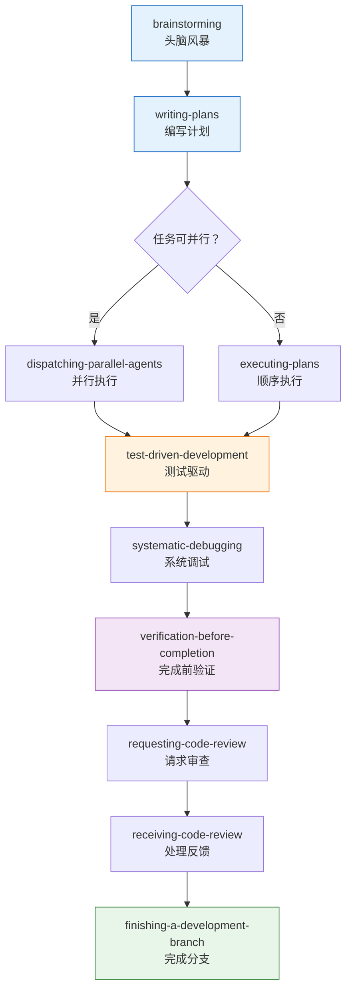

# Superpowers 插件详解

Superpowers 是 Claude Code 最强大的**开发流程插件套件**，涵盖从头脑风暴到代码发布的完整工作流。它不是一个技能，而是一组**互相配合的技能集合**，按照软件开发最佳实践设计。

## 插件总览

Superpowers 套件包含三大类技能，再加上关联的 feature-dev、claude-md-management 和 figma 插件：

| 类别 | 技能数量 | 核心定位 |
|------|---------|---------|
| 开发流程类 | 5 | 从构思到执行的完整链路 |
| 质量保证类 | 5 | 测试、验证、审查的全覆盖 |
| 工具类 | 3 | Git 工作流和技能管理 |
| feature-dev 插件 | 4 | 功能开发专项支持 |
| claude-md-management 插件 | 2 | 项目配置管理 |
| figma 插件 | 5+ | 设计到代码的桥梁 |

---

## Superpowers 开发工作流

以下是一个典型的使用 Superpowers 的完整开发流程：



---

## 开发流程类

### `brainstorming` — 头脑风暴

**规则：任何创造性工作开始前必须先调用此技能。**

在你说"开始写代码"之前，`brainstorming` 强制你先想清楚三个问题：

1. **Intent（意图）** — 你到底想实现什么？
2. **Requirements（需求）** — 具体需要满足哪些条件？
3. **Design（设计）** — 大致的技术方案是什么？

```bash
/brainstorming
# Claude 会引导你逐步探索：
# > 你的目标用户是谁？
# > 核心功能是什么？
# > 有哪些约束条件？
# > 参考方案有哪些？
```

::: tip 为什么是"必须"
跳过头脑风暴直接写代码是最常见的返工原因。5 分钟的思考可以节省 5 小时的重写。Superpowers 强制这个流程，不是为了拖慢你，而是为了让你更快。
:::

### `writing-plans` — 编写实施计划

将头脑风暴的结果转化为**可执行的多步骤计划**。计划会在实际编码之前被完整写出。

```bash
/writing-plans
# 输出一个结构化计划：
# Step 1: 创建数据模型 (estimated: 15min)
# Step 2: 实现 API 路由 (estimated: 30min)
# Step 3: 编写单元测试 (estimated: 20min)
# Step 4: 添加前端组件 (estimated: 45min)
# ...
```

计划的特点：

- 每步有明确的输入和输出
- 步骤之间的依赖关系清晰
- 包含预估时间
- 包含检查点（checkpoint），方便暂停和恢复

### `executing-plans` — 执行计划

在**独立会话**中执行计划，每个检查点会暂停让你 review。

```bash
/executing-plans
# Claude 开始按计划执行：
# [Step 1/4] 创建数据模型...
#   ✓ 完成 — 等待 review
# 
# 你确认后继续：
# [Step 2/4] 实现 API 路由...
```

关键设计：

- **独立会话**执行，保持上下文纯净
- 每个 checkpoint 暂停等待确认
- 可以随时调整后续步骤
- 失败时可以回退到上一个 checkpoint

### `subagent-driven-development` — 子 Agent 驱动开发

当实施计划中有**互相独立的任务**时，可以在当前会话中启动多个子 Agent 并行执行。

```bash
/subagent-driven-development
# 分析计划，识别可并行的任务：
# Agent A: 实现用户模型 + API
# Agent B: 实现支付模型 + API
# Agent C: 编写 E2E 测试骨架
```

适用条件：

- 任务之间没有共享状态
- 不需要顺序依赖
- 各自有独立的文件作用域

### `dispatching-parallel-agents` — 分发并行 Agent

当面对 **2 个或以上完全独立的任务**时使用。与 `subagent-driven-development` 的区别在于，它更适合任务之间**完全没有关联**的场景。

```bash
/dispatching-parallel-agents
# 任务 1: 重构认证模块（独立）
# 任务 2: 修复支付页面 bug（独立）
# 任务 3: 更新 API 文档（独立）
# → 分发给 3 个独立 Agent 并行处理
```

| 技能 | 适用场景 | 任务关系 |
|------|---------|---------|
| `executing-plans` | 有序步骤 | 步骤间有依赖 |
| `subagent-driven-development` | 计划内并行 | 同一计划的独立部分 |
| `dispatching-parallel-agents` | 完全并行 | 毫无关联的独立任务 |

---

## 质量保证类

### `test-driven-development` — 测试驱动开发

**规则：先写测试，再写实现。**

```bash
/test-driven-development
# 流程：
# 1. 根据需求编写失败的测试
# 2. 运行测试，确认是红色（失败）
# 3. 编写最少的代码让测试通过
# 4. 运行测试，确认是绿色（通过）
# 5. 重构，保持测试绿色
```

TDD 循环：`Red → Green → Refactor`

这个技能确保每次 coding 前都有对应的测试，避免"写完再补测试"导致覆盖率不足。

### `verification-before-completion` — 完成前验证

**规则：在声称"完成"之前，必须运行验证命令并确认输出。**

这是防止"我觉得改好了"但实际没验证的情况：

```bash
/verification-before-completion
# 在你说"搞定了"之前：
# 1. 运行测试套件 → 查看输出
# 2. 运行类型检查 → 查看输出
# 3. 运行 lint → 查看输出
# 4. 手动验证核心功能 → 确认结果
# 所有验证通过后才能声称完成
```

核心原则：**Evidence before assertions**（先有证据再下结论）。

### `systematic-debugging` — 系统化调试

在修复任何 bug 或测试失败之前，强制使用系统化方法。与 `/investigate` 技能理念一致，但更轻量。

```bash
/systematic-debugging
# 在修 bug 之前：
# 1. 确认问题可以复现
# 2. 收集相关日志和错误信息
# 3. 形成假设
# 4. 验证假设
# 5. 才开始修复
```

### `requesting-code-review` — 请求代码审查

完成实现后，用这个技能让 Claude 验证工作是否满足原始需求。

```bash
/requesting-code-review
# Claude 会检查：
# - 所有需求是否都被实现
# - 代码质量是否达标
# - 测试覆盖是否充分
# - 有没有遗漏的边界情况
```

### `receiving-code-review` — 处理审查反馈

当收到 code review 反馈时使用。**不是所有反馈都要照做**——这个技能要求用技术严谨性评估每条反馈。

```bash
/receiving-code-review
# 对每条反馈：
# 1. 理解反馈的技术依据
# 2. 验证反馈是否正确
# 3. 如果正确 → 实施修改
# 4. 如果有争议 → 用证据讨论
# 5. 如果不正确 → 礼貌说明原因
```

::: warning 重要原则
不要"表演式同意"（performative agreement）。review 反馈不一定都是对的，盲目实施错误的建议比不改更糟糕。
:::

---

## 工具类

### `using-git-worktrees` — 智能工作树

在开始功能开发时，创建隔离的 Git worktree，避免影响当前工作区。

```bash
/using-git-worktrees
# Claude 会：
# 1. 分析当前仓库状态
# 2. 智能选择目录位置
# 3. 创建 worktree 并切换
# 4. 完成后提供清理选项
```

### `finishing-a-development-branch` — 完成开发分支

当实现完成、测试通过后，引导你完成分支的最后一步。提供结构化选项：

| 选项 | 说明 | 适用场景 |
|------|------|---------|
| Merge | 直接合并到主分支 | 小改动、独立修复 |
| PR | 创建 Pull Request | 团队协作、需要 review |
| Cleanup | 清理分支，不合并 | 实验性工作、废弃方案 |

### `skill-creator` — 技能创建器

创建、修改和测试自定义技能，包含评估和基准测试功能。

```bash
/skill-creator
# 功能包括：
# - 从零创建新技能
# - 修改优化已有技能
# - 运行 eval 测试技能效果
# - 基准测试性能和方差分析
```

---

## feature-dev 插件

feature-dev 是面向**功能开发**的专项插件套件：

| 技能 | 功能 | 使用场景 |
|------|------|---------|
| `feature-dev` | 引导式功能开发 | 从需求到代码的完整引导 |
| `code-explorer` | 代码库探索 | 理解陌生代码库的架构 |
| `code-reviewer` | 代码审查 | 独立的代码审查视角 |
| `code-architect` | 架构设计 | 系统架构决策 |

### `feature-dev` — 引导式功能开发

聚焦于**代码库理解和架构**的功能开发。在开始编码之前，先确保充分理解现有代码的结构：

```bash
/feature-dev
# 流程：
# 1. 理解现有代码架构
# 2. 确定新功能的最佳放置位置
# 3. 设计与现有代码一致的接口
# 4. 实施开发
```

---

## claude-md-management 插件

管理项目的 `CLAUDE.md` 配置文件：

| 技能 | 功能 |
|------|------|
| `revise-claude-md` | 从当前会话中提取经验，更新 CLAUDE.md |
| `claude-md-improver` | 审计所有 CLAUDE.md 文件，评估质量，输出报告并改进 |

```bash
# 会话结束前，保存有价值的发现
/revise-claude-md

# 定期审计 CLAUDE.md 质量
/claude-md-improver
```

---

## figma 插件套件

连接设计和代码的桥梁：

| 技能 | 功能 |
|------|------|
| `figma-implement-design` | 将 Figma 设计翻译为生产代码，1:1 视觉还原 |
| `figma-code-connect` | 创建 Figma 组件到代码组件的映射 |
| `figma-generate-library` | 从代码生成 Figma 设计系统 |
| `figma-generate-design` | 将应用页面推送到 Figma |
| `figma-use` | 通过 Plugin API 直接操作 Figma 文件 |
| `figma-create-design-system-rules` | 生成项目专属的设计系统规则 |

::: tip 使用前提
figma 插件需要配置 Figma MCP Server。安装后提供 Figma URL 即可开始使用。
:::

---

## 完整技能参考表

### Superpowers 核心技能

| 技能 | 类别 | 触发时机 | 是否强制 |
|------|------|---------|---------|
| `brainstorming` | 开发流程 | 创造性工作开始前 | 是 |
| `writing-plans` | 开发流程 | 有规格/需求时 | 推荐 |
| `executing-plans` | 开发流程 | 有计划待执行时 | 推荐 |
| `subagent-driven-development` | 开发流程 | 计划中有独立任务 | 可选 |
| `dispatching-parallel-agents` | 开发流程 | 2+ 完全独立的任务 | 可选 |
| `test-driven-development` | 质量保证 | 实现功能/修复前 | 推荐 |
| `verification-before-completion` | 质量保证 | 声称完成前 | 是 |
| `systematic-debugging` | 质量保证 | 遇到 bug/失败时 | 是 |
| `requesting-code-review` | 质量保证 | 完成实现后 | 推荐 |
| `receiving-code-review` | 质量保证 | 收到 review 反馈时 | 是 |
| `using-git-worktrees` | 工具 | 开始隔离工作时 | 可选 |
| `finishing-a-development-branch` | 工具 | 实现完成后 | 推荐 |
| `skill-creator` | 工具 | 创建/修改技能时 | 可选 |

### 关联插件技能

| 技能 | 插件 | 功能 |
|------|------|------|
| `feature-dev` | feature-dev | 引导式功能开发 |
| `code-explorer` | feature-dev | 代码库探索 |
| `code-reviewer` | feature-dev | 代码审查 |
| `code-architect` | feature-dev | 架构设计 |
| `revise-claude-md` | claude-md-management | 更新 CLAUDE.md |
| `claude-md-improver` | claude-md-management | 审计 CLAUDE.md |
| `figma-implement-design` | figma | 设计转代码 |
| `figma-code-connect` | figma | 组件映射 |
| `figma-generate-library` | figma | 生成设计系统 |

---

## 如何选择合适的技能

### 按开发阶段选择

```
需求阶段 → brainstorming
规划阶段 → writing-plans
开发阶段 → executing-plans / subagent-driven-development
测试阶段 → test-driven-development
调试阶段 → systematic-debugging
验证阶段 → verification-before-completion
审查阶段 → requesting-code-review / receiving-code-review
发布阶段 → finishing-a-development-branch
```

### 按场景选择

| 你想做什么 | 使用哪个技能 |
|-----------|-------------|
| 开始一个新功能 | `brainstorming` → `writing-plans` → `executing-plans` |
| 快速修一个 bug | `systematic-debugging` → `verification-before-completion` |
| 并行处理多个任务 | `dispatching-parallel-agents` |
| 理解一个陌生代码库 | `code-explorer` |
| 从 Figma 设计稿写代码 | `figma-implement-design` |
| 创建自己的技能 | `skill-creator` |
| 提升 CLAUDE.md 质量 | `claude-md-improver` |

---

## 最佳实践

1. **不要跳过 `brainstorming`** — 它是被标记为"强制"的，有原因
2. **让 `verification-before-completion` 成为习惯** — "我觉得好了"不算好了，运行通过才算
3. **善用并行** — 如果任务独立，`dispatching-parallel-agents` 可以大幅提速
4. **review 要有技术判断** — `receiving-code-review` 教你批判性地处理反馈
5. **计划先行** — `writing-plans` 看起来慢，实际上最快

---

上一篇：[安全与调试技能 ←](/zh/features/skills-safety) | 下一篇：[MCP Servers →](/zh/features/mcp-servers)
