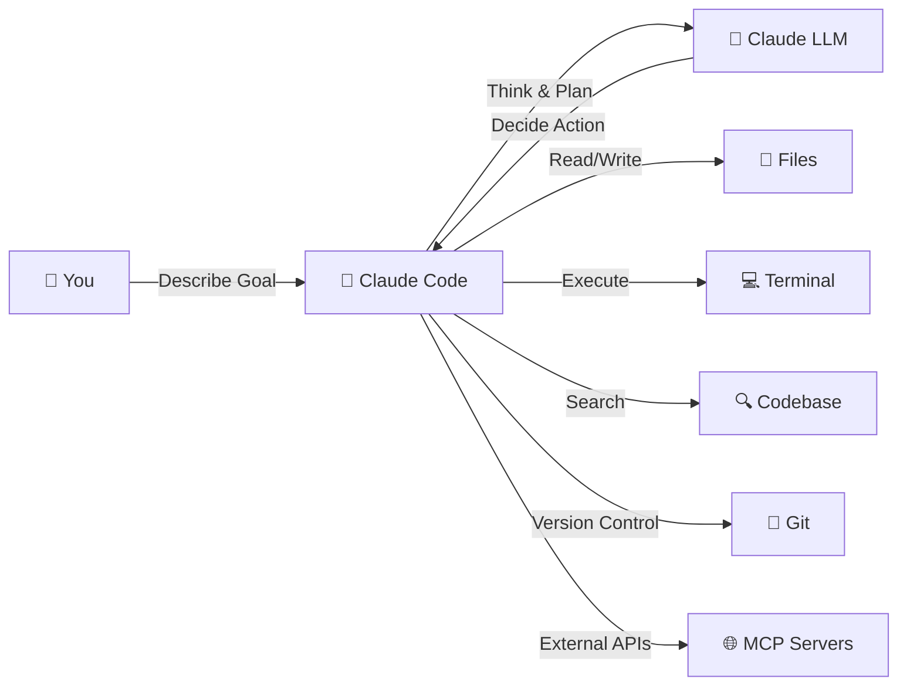
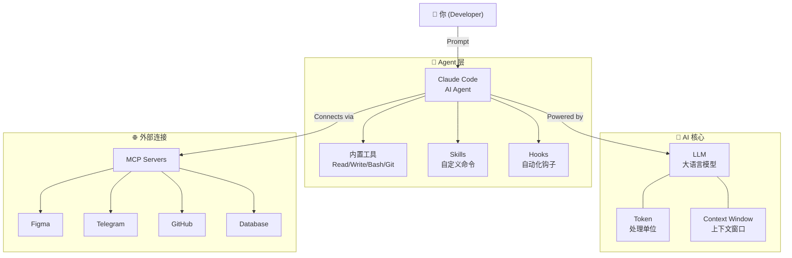

# AI 基础概念

在开始使用 Claude Code 之前，我们需要了解一些 AI 领域的核心概念。这些概念将帮助你更好地理解 Claude Code 的工作原理，并让你在使用时做出更明智的决策。

## 什么是大语言模型（LLM）

**大语言模型**（Large Language Model，简称 LLM）是一种基于深度学习的 AI 模型，通过阅读海量文本数据来学习语言的规律。

### 类比理解

想象一个读过世界上所有书籍、代码和文档的超级学者。当你向它提问时，它会根据学到的知识，**预测最合理的下一个词**，一个词接一个词地生成回答。

```
你的问题: "用 Python 写一个排序函数"
     ↓
LLM 内部: 根据学过的百万个代码示例，逐词预测最可能的回答
     ↓
生成结果: def sort_list(arr): return sorted(arr)
```

### 常见的 LLM

| 模型 | 开发者 | 特点 |
|------|--------|------|
| Claude | Anthropic | Claude Code 的核心引擎 |
| GPT | OpenAI | ChatGPT 背后的模型 |
| Gemini | Google | Google 的多模态模型 |
| Llama | Meta | 开源大模型 |

::: tip 关键理解
LLM 不是"搜索引擎"——它不是在数据库中查找答案，而是根据学到的模式**生成**答案。这意味着它可能会"编造"看起来合理但实际错误的内容（即"幻觉"）。
:::

## 什么是 Token

**Token** 是 LLM 处理文本的基本单位。你可以把它理解为模型"阅读"和"书写"的最小块。

### Token 不等于字符

一个 Token 大约是：
- 英文中的 **3-4 个字符**（约 0.75 个单词）
- 中文中的 **1-2 个汉字**

```python
# 这段代码大约包含多少 Token？
# （不同模型的 tokenizer 切分方式略有不同，以下为近似值）
def hello():          # ~3 tokens: [def] [hello] [():]
    print("Hello!")   # ~4 tokens: [print] [("] [Hello] [!")]
    return True       # ~2 tokens: [return] [True]
# 总计约 9 个 Token
```

::: info 小贴士
Token 的切分因模型而异，上面只是近似演示。你可以用 [Anthropic Tokenizer](https://docs.anthropic.com/en/docs/build-with-claude/token-counting) 查看精确计数。关键是理解：**Token ≠ 字符 ≠ 单词**，它是介于两者之间的单位。
:::

### 为什么 Token 重要？

Token 直接影响两件事：

1. **成本** —— API 按 Token 数量计费
2. **能力上限** —— 每个模型有 Token 数量限制

```
Claude Sonnet 4: 输入 200K tokens, 输出 64K tokens
大约相当于: 可以一次性阅读一本 500 页的书
```

::: info 小贴士
在 Claude Code 中，你不需要手动计算 Token。但了解这个概念能帮助你理解为什么有时候 Claude 会"忘记"之前的对话内容——因为上下文窗口是有限的。
:::

## 什么是上下文窗口（Context Window）

**上下文窗口**是 LLM 一次对话中能"记住"的全部信息量，以 Token 为单位衡量。

### 类比理解

把上下文窗口想象成一张**工作桌**：

```
┌──────────────────────────────────────────┐
│              上下文窗口（工作桌）            │
│                                          │
│  [系统提示词]  [你的代码文件]  [对话历史]    │
│  [工具调用记录]  [文件内容]  [当前问题]      │
│                                          │
│  桌子大小有限，放不下时就得清理旧的东西       │
└──────────────────────────────────────────┘
```

当上下文窗口满了，最早的对话内容会被"推出"窗口，模型就无法再看到那些信息。

### 在 Claude Code 中的影响

```bash
# Claude Code 会自动管理上下文窗口
# 当窗口接近上限时，你会看到类似提示：
> Context window usage: 85% (170K / 200K tokens)

# 此时可以用 /compact 命令压缩上下文
> /compact
```

::: warning 注意
当你在一个长对话中处理大型代码库时，Claude 可能会"忘记"早期讨论的内容。这不是 Bug，而是上下文窗口的限制。遇到这种情况，可以使用 `/compact` 或开始新对话。
:::

## 什么是 Agent

**Agent**（智能体）是一种能够**自主决策和执行操作**的 AI 系统。与简单的问答 AI 不同，Agent 可以：

1. **理解目标** —— 分析你的需求
2. **制定计划** —— 拆解成多个步骤
3. **执行操作** —— 调用工具完成每一步
4. **观察结果** —— 检查执行结果
5. **调整策略** —— 根据结果决定下一步

### Agent vs 普通聊天机器人

```
普通聊天机器人:
  你: "帮我创建一个 React 项目"
  AI: "你可以运行 npx create-react-app my-app..." (只给建议)

Agent (Claude Code):
  你: "帮我创建一个 React 项目"
  AI:
    1. 执行 npx create-react-app my-app  ← 实际运行命令
    2. 检查项目结构是否正确              ← 验证结果
    3. 安装额外依赖                      ← 继续执行
    4. 修改配置文件                      ← 自主操作
    5. "项目已创建完成，结构如下..."      ← 汇报结果
```

### Claude Code 就是一个 Agent

Claude Code 不仅能回答问题，还能：

- 📂 读写你的文件系统
- 🖥️ 执行终端命令
- 🔍 搜索代码库
- 🔧 使用 Git 进行版本控制
- 🌐 调用外部工具（通过 MCP）



::: tip Agent 的核心价值
Agent 的关键在于**自主性**。你不需要一步一步指导它，只需要描述目标，它会自己找到实现路径。这就是 Claude Code 与普通代码补全工具的本质区别。
:::

## 什么是 Prompt Engineering

**Prompt Engineering**（提示工程）是一门设计和优化 AI 输入提示（Prompt）的技术，目的是让 AI 产出更好的结果。

### 基本原则

```markdown
❌ 差的 Prompt:
"帮我写个函数"

✅ 好的 Prompt:
"用 TypeScript 写一个函数，接收一个用户数组，
 按注册日期降序排序，返回最近 30 天内注册的活跃用户。
 需要包含类型定义和错误处理。"
```

### 在 Claude Code 中的实践

Claude Code 中的 Prompt Engineering 体现在几个层面：

**1. 系统提示词（CLAUDE.md）**

```markdown
# CLAUDE.md - 项目级别的持久提示词
## 项目约定
- 使用 TypeScript strict 模式
- 组件使用 PascalCase 命名
- 所有函数必须有 JSDoc 注释
```

**2. 日常对话中的提示技巧**

```bash
# 提供上下文
> 我在开发一个电商网站的购物车模块，请帮我...

# 指定约束条件
> 用 React hooks 实现，不要用 class 组件，需要支持 SSR

# 给出示例
> 参考 src/components/ProductList.tsx 的风格来写
```

**3. 使用 @ 引用提供精确上下文**

```bash
# 让 Claude 先阅读相关文件
> 看一下 @src/types/user.ts 和 @src/api/auth.ts，
  然后帮我实现用户注册功能
```

::: tip Prompt Engineering 最佳实践
1. **明确具体** —— 说清楚你要什么，不要让 AI 猜
2. **提供上下文** —— 告诉 AI 项目背景和约束
3. **分步骤来** —— 复杂任务拆成小步骤
4. **给示例** —— 用 `@` 引用现有代码作为参考
5. **迭代优化** —— 如果结果不满意，调整提示重新来
:::

## 概念之间的关系

让我们把这些概念串联起来：

```
Prompt Engineering (你的输入)
        ↓
   Context Window (工作空间)
        ↓
      LLM (大脑)
    ↙        ↘
Token (思考单位)  Agent (执行能力)
                    ↓
              工具调用 & 代码执行
```

在 Claude Code 中：
1. 你通过 **Prompt** 描述需求
2. Claude 在 **Context Window** 中理解你的需求和代码
3. **LLM** 以 **Token** 为单位思考和生成
4. **Agent** 能力让 Claude 不只是回答，还能实际操作

## 概念关系全景图

下面这张图展示了所有概念之间的关系：



## 小结

| 概念 | 一句话解释 |
|------|-----------|
| LLM | AI 的"大脑"，通过学习文本来理解和生成语言 |
| Token | AI 处理文本的最小单位，影响成本和上下文大小 |
| Context Window | AI 的"工作记忆"，决定它能同时处理多少信息 |
| Agent | 能自主执行操作的 AI 系统，不只是聊天 |
| Prompt Engineering | 优化 AI 输入的技术，让 AI 更好地理解你的需求 |
| MCP | 连接外部工具和服务的协议 |
| Skills | 可扩展的自定义命令系统 |
| Hooks | 事件驱动的自动化钩子 |

理解了这些基础概念，你就能更有效地使用 Claude Code。接下来，让我们深入了解 Claude Code 本身。

---

> 下一篇：[什么是 Claude Code](./what-is-claude-code.md)
