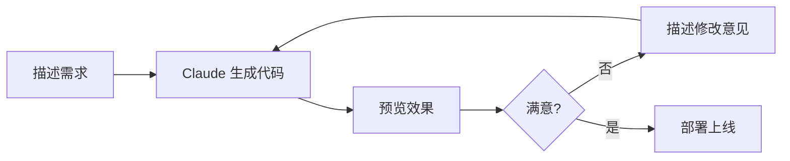
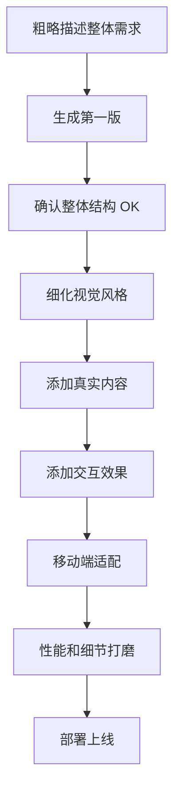

# 用 Claude Code 搭建网站

Vibe Coding 是一种全新的编程方式：你只需要描述想要什么，AI 来帮你实现。本文通过一个完整的实战案例，展示如何用 Claude Code 从零搭建一个网站，全程几乎不需要手写代码。

## 什么是 Vibe Coding

Vibe Coding 的核心理念很简单：

> **用自然语言描述需求，让 AI 生成代码，通过不断迭代达到满意的效果。**

你不需要精通 HTML/CSS/JavaScript，只需要知道自己想要什么样的网站，然后用语言把它描述出来。Claude Code 会帮你把想法变成可运行的代码。



::: tip Vibe Coding 适合什么场景
- 个人主页、作品集、简历网站
- 活动落地页、产品宣传页
- 小型工具站、单页应用
- 快速原型验证
:::

## 实战项目：个人主页

我们以搭建一个个人主页为例，完整演示 Vibe Coding 的流程。最终效果是一个包含自我介绍、技能展示、作品集和联系方式的单页网站。

### Step 1: 描述你的愿景

打开终端，启动 Claude Code，直接告诉它你想要什么：

```bash
claude
```

然后输入你的需求：

```
帮我创建一个个人主页，要求：
- 单页 HTML，使用 Tailwind CSS
- 深色主题，科技感风格
- 包含以下板块：Hero 区域（头像+名字+一句话介绍）、关于我、技能标签、项目展示（3个卡片）、联系方式
- 头像用占位图，后续替换
- 要有平滑滚动效果
- 移动端适配
```

::: tip 描述越具体，效果越好
与其说"帮我做个好看的网站"，不如明确说出：
- **风格**：深色/浅色、科技感/文艺风、极简/华丽
- **板块**：具体列出每个区域的内容
- **技术栈**：Tailwind CSS、React、纯 HTML 等
- **参考**：如果有喜欢的网站，可以贴链接
:::

Claude 会生成一个完整的 `index.html` 文件，包含结构、样式和基本交互。

### Step 2: 预览并迭代

生成代码后，先预览看看效果：

```bash
# 用浏览器打开
open index.html

# 或使用 Claude Code 的 /browse 命令查看
```

看到效果后，继续提出修改意见：

```
修改以下内容：
1. Hero 区域的标题改为 "Hi, I'm Alex"，副标题改为 "Full-Stack Developer & Open Source Enthusiast"
2. 背景加一个渐变动画效果，从深蓝到深紫缓慢过渡
3. 技能标签加上图标，用 emoji 就行
```

Claude 会直接修改现有文件，不需要你手动定位代码位置。

### Step 3: 添加真实内容

替换占位内容为真实数据：

```
把项目展示区域的三个卡片改为：
1. "Claude Tutorial" - 一个教程网站，帮助用户学习 Claude Code，标签：VitePress, AI
2. "Trading Bot" - 量化交易机器人，标签：Python, Finance
3. "Web3 Toolkit" - 区块链开发工具集，标签：Solidity, TypeScript

每个卡片加一个 GitHub 链接按钮
```

如果你有头像图片，可以直接指定路径：

```
把头像替换为 ./assets/avatar.jpg，圆形裁切，加一个发光边框效果
```

### Step 4: 添加交互功能

网站的基础内容完成后，可以添加更丰富的交互：

```
添加以下功能：
1. 顶部导航栏，滚动时固定并加半透明毛玻璃效果
2. 页面滚动时各板块有淡入动画
3. 技能标签点击后显示详细说明的 tooltip
4. 加一个暗色/亮色主题切换按钮
```

还可以添加更复杂的交互元素：

```
在页面底部加一个小彩蛋：
一个简单的小测验 "你有多了解我"，3 道选择题，
答完显示得分和对应的评价
```

Claude 会生成完整的 HTML + JavaScript 代码来实现这些交互。

### Step 5: 移动端适配检查

使用 `/browse` 命令检查移动端显示效果：

```
/browse

用手机尺寸（375x667）打开 index.html，截图给我看看移动端效果
```

根据截图反馈调整：

```
移动端有以下问题：
1. 导航栏的链接文字太小，改成汉堡菜单
2. 项目卡片在手机上应该单列显示
3. Hero 区域的标题在小屏幕上换行不好看，字号缩小一点
```

::: warning 注意跨设备测试
Vibe Coding 很容易只关注桌面端效果而忽略移动端。建议在开发过程中多次使用 `/browse` 在不同尺寸下检查，越早发现问题越容易修复。
:::

### Step 6: 部署到 GitHub Pages

网站效果满意后，部署上线：

```
帮我配置 GitHub Pages 部署：
1. 初始化 git 仓库
2. 创建 .gitignore
3. 把文件推送到 GitHub
4. 配置 GitHub Pages 从 main 分支的根目录部署
```

Claude 会执行完整的部署流程：

```bash
# Claude 执行的命令大致如下
git init
git add .
git commit -m "Initial commit: personal portfolio site"
git remote add origin https://github.com/yourusername/portfolio.git
git push -u origin main
```

然后在 GitHub 仓库的 **Settings > Pages** 中启用 GitHub Pages。

#### 配置自定义域名

如果你有自己的域名：

```
帮我配置自定义域名 alex.dev：
1. 创建 CNAME 文件
2. 告诉我需要在 DNS 设置什么记录
```

Claude 会创建 `CNAME` 文件并告诉你需要在域名服务商添加的 DNS 记录：

```
# DNS 配置
类型: CNAME
名称: @（或你的子域名）
值: yourusername.github.io
```

## Vibe Coding 技巧总结

### 高效沟通的原则

| 原则 | 好的例子 | 不好的例子 |
|------|---------|-----------|
| 具体描述 | "标题用 48px 加粗白色" | "标题大一点" |
| 分步迭代 | 每次修改 1-3 个地方 | 一次提 20 个修改 |
| 给出参考 | "类似 Linear.app 的风格" | "做好看一点" |
| 说明原因 | "按钮太小不好点，改成 48px" | "改改按钮" |

### 迭代策略



**推荐的迭代顺序**：

1. **先结构后细节**：先确认页面布局和板块划分，再调整颜色字号
2. **先桌面后移动**：在桌面端调整好效果，再处理响应式
3. **先静态后动态**：先把内容和样式做好，再添加动画和交互
4. **先功能后美化**：确保所有功能可用，再打磨视觉效果

### 使用截图反馈

当你用 `/browse` 预览效果或在浏览器中查看时，可以截图然后描述具体问题：

```
截图中左上角的 logo 和右边的导航栏没有垂直对齐，
logo 偏上了大概 5px，请修复
```

视觉问题用语言描述比较抽象，截图 + 具体描述是最高效的反馈方式。

### 常见需求速查

需要灵感或不知道怎么描述？参考这些常用提示词：

```
# 动画效果
"给所有卡片加 hover 时上浮 + 阴影加深的效果"
"页面加载时各元素依次淡入，间隔 200ms"

# 布局调整
"三列网格在平板上变两列，手机上变单列"
"用 CSS Grid 重新排列这个区域，照片在左文字在右"

# 视觉风格
"整体改成类似 Notion 的简约风格，多用留白"
"加一个 glassmorphism 风格的卡片背景"

# 功能添加
"加一个回到顶部的浮动按钮，滚动超过 500px 后显示"
"表单提交后显示 loading 动画，2 秒后跳转到感谢页"
```

## 小结

Vibe Coding 的核心是**对话式开发**：

1. 用自然语言描述你想要的效果
2. Claude Code 生成完整的可运行代码
3. 预览效果并用语言反馈修改意见
4. 不断迭代直到满意
5. 一键部署上线

整个过程中，你的角色是**产品经理**和**设计师**，Claude Code 是你的**全栈开发者**。你不需要纠结于 CSS 属性的写法或 JavaScript 的语法，只需要知道自己想要什么，然后清楚地表达出来。
