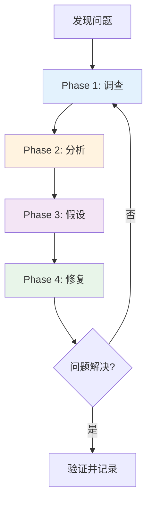
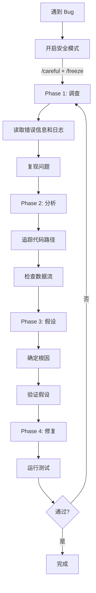

# Debug 工作流

调试是开发中最耗时的环节之一。盲目地猜测和修改往往事倍功半，而系统化的调试方法能帮你快速定位问题根因。本文介绍如何利用 Claude Code 建立高效的调试工作流。

## 为什么需要系统化调试

你是否遇到过这样的场景？

- 一个 bug 修了三天，最后发现是拼写错误
- 改了一个地方，引入了两个新 bug
- 同一个问题反复出现，每次都花时间排查

这些问题的根源在于**没有系统化的调试流程**。很多时候我们看到报错就急于修改，跳过了理解问题本质的关键步骤。

::: tip 调试的铁律
**不找到根因，不动手修改。**

过早修改代码可能只是掩盖了症状，真正的问题依然存在。
:::

## `/investigate` 命令：四阶段调试法

Claude Code 的 `/investigate` 命令实现了一套系统化的调试方法，分为四个阶段：



### Phase 1: 调查（Investigate）

**目标**：收集所有相关信息，复现问题。

这个阶段你不写任何修复代码，只做三件事：

1. **阅读错误信息**：完整阅读报错的 stack trace，不要只看第一行
2. **查看日志**：检查相关的日志文件和输出
3. **复现问题**：确保能稳定重现这个 bug

```
/investigate

错误信息：TypeError: Cannot read properties of undefined (reading 'map')
出现在 src/components/UserList.tsx 第 42 行
刷新页面后必现
```

Claude 会系统地检查：
- 错误发生的文件和上下文
- 相关数据流的来源
- 最近的代码变更

### Phase 2: 分析（Analyze）

**目标**：理解代码路径和上下文。

Claude 会追踪代码的执行路径：

```
# Claude 的分析过程（示意）

1. UserList.tsx:42 调用了 users.map()
2. users 来自 useUsers() hook
3. useUsers() 从 /api/users 获取数据
4. API 返回格式为 { data: [...], meta: {...} }
5. 但 hook 直接返回了 response，没有取 response.data
6. 所以 users 实际上是 { data: [...], meta: {...} }，不是数组
```

这个阶段的关键是**追踪数据流**，从错误点向上追溯数据的来源。

### Phase 3: 假设（Hypothesize）

**目标**：形成对根因的判断。

基于分析结果，Claude 会给出假设：

```
根因假设：
useUsers hook 返回了完整的 API response 对象，
而不是 response.data 数组。

在 API 改版之前，接口直接返回数组，所以这段代码可以工作。
API 改版后返回了包装对象 { data: [], meta: {} }，
但 hook 没有相应更新。

验证方式：检查 API 的变更历史和 hook 的返回值
```

### Phase 4: 修复（Implement）

**目标**：精准修复，验证结果。

确认根因后才开始修复：

```
修复方案：
1. 修改 useUsers hook，返回 response.data 而不是 response
2. 添加类型检查，确保返回值是数组
3. 添加空值保护，防止 API 返回 null 时崩溃
```

修复后必须验证：

```bash
# 运行相关测试
npm test -- --grep "UserList"

# 手动验证
npm run dev
# 检查页面是否正常渲染
```

## 常见调试场景

### 构建错误

构建错误通常比较直接，但有时也会很棘手：

**依赖冲突**

```
帮我调查这个构建错误：
npm ERR! ERESOLVE unable to resolve dependency tree
npm ERR! peer dep missing: react@^17.0.0, required by some-old-package@1.2.3
```

Claude 会分析依赖树，找出冲突的包，并建议升级或使用 `--legacy-peer-deps`。

**TypeScript 类型错误**

```
帮我调查这个类型错误：
Type 'string | undefined' is not assignable to type 'string'.
在 src/utils/parser.ts:87
```

Claude 会检查类型定义的完整链路，而不是简单地加 `as string` 强制转换。

::: warning 不要用 `any` 掩盖类型错误
`as any` 或 `// @ts-ignore` 只是把类型错误藏起来了，运行时该崩还是会崩。让 Claude 找到类型不匹配的真正原因。
:::

### 运行时错误

**React Hydration Mismatch**

```
/investigate

页面加载时出现 hydration mismatch 错误：
Warning: Text content did not match. Server: "2024-01-01" Client: "2025-04-03"
```

Claude 会识别出这是服务端渲染和客户端渲染的输出不一致，通常原因是：
- 使用了 `new Date()` 等时间相关的代码
- 使用了 `Math.random()`
- 使用了 `window` 或 `localStorage` 等浏览器 API

**Undefined Reference**

```
/investigate

Uncaught ReferenceError: process is not defined
出现在 Vite 构建的生产环境
```

常见原因：Vite 不会像 Webpack 那样自动注入 `process.env`，需要使用 `import.meta.env`。

### CI/CD 失败

**Workflow 权限不足**

```
/investigate

GitHub Actions 报错：
Error: Resource not accessible by integration
在 Post Review Comment 步骤
```

Claude 会检查 workflow 的 `permissions` 配置和仓库的 Actions 设置。

**Runner 相关问题**

```
/investigate

GitHub Actions 一直 queued 不执行，
使用的是自建 runner，标签是 claude-runner
```

Claude 会指导你检查 runner 的在线状态、标签匹配和网络连接。

### 性能问题

使用 `/benchmark` 命令建立性能基准：

```
/benchmark

检查首页加载性能，对比优化前后的数据
```

常见性能问题和调试方向：

| 问题 | 调试方向 |
|------|---------|
| 首屏加载慢 | 检查 bundle 大小，是否有未 tree-shake 的依赖 |
| 页面卡顿 | 检查是否有不必要的重渲染或大量 DOM 操作 |
| API 响应慢 | 检查 N+1 查询、缺少索引、未启用缓存 |
| 内存泄漏 | 检查未清理的事件监听器和定时器 |

## Claude Code 的调试工具箱

Claude Code 提供了多种工具来辅助调试：

### Read：阅读日志和代码

```
帮我看看 /var/log/app.log 最后 100 行有什么错误
```

Claude 会读取文件内容并分析其中的异常信息。

### Grep：搜索代码模式

```
在整个项目中搜索所有使用 process.env 的地方
```

Claude 会用正则搜索找到所有相关代码，帮你评估影响范围。

### Bash：运行诊断命令

```
检查一下 node_modules 里有没有重复安装的 react
运行 npm ls react 看看依赖树
```

Claude 可以直接执行命令获取系统信息。

### /browse：视觉问题调试

```
/browse

打开 http://localhost:3000/dashboard
截图给我看看，页面右侧有个布局错位
```

对于样式和布局问题，视觉反馈比日志更有效。

## 安全调试：/careful 和 /freeze

调试时最怕的是改着改着把好的代码也改坏了。Claude Code 提供了两个安全机制：

### /careful：危险操作警告

```
/careful
```

启用后，Claude 在执行可能有破坏性的操作前会先警告你：

- `rm -rf` 删除文件
- `git reset --hard` 重置代码
- `DROP TABLE` 删除数据库表
- `docker system prune` 清理容器

### /freeze：限制编辑范围

```
/freeze src/components/
```

调试时经常只需要修改某个模块。`/freeze` 可以限制 Claude 只编辑指定目录下的文件，防止意外修改其他代码。

::: tip 调试时推荐同时使用
```
/careful
/freeze src/features/auth/
```
这样既有危险操作警告，又有编辑范围限制，最大程度避免调试时引入新问题。
:::

## 调试流程速查



## 小结

| 阶段 | 做什么 | 不做什么 |
|------|--------|---------|
| 调查 | 读错误信息、查日志、复现 | 不猜测原因 |
| 分析 | 追踪代码路径、理解上下文 | 不跳到修复 |
| 假设 | 提出根因理论并验证 | 不做无证据的猜测 |
| 修复 | 精准修改、运行测试 | 不做无关的"顺手"修改 |

记住调试的铁律：**不找到根因，不动手修改。** 有了 Claude Code 的 `/investigate` 和系统化调试流程，大部分 bug 都能高效地被定位和修复。
