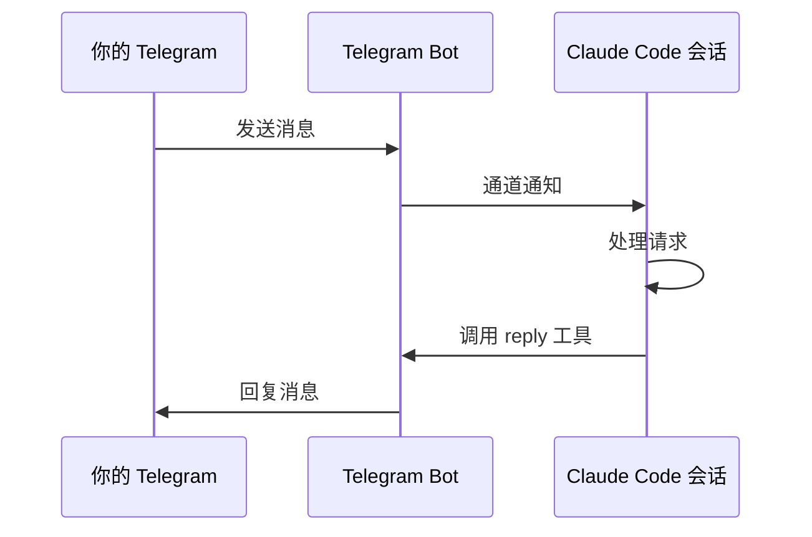

# Telegram Bot 集成

通过 Telegram 集成，你可以在手机或任何设备上随时向 Claude Code 发送消息、接收回复，实现真正的**远程 AI 编程助手**。无论是外出时快速审查代码，还是在手机上触发部署，Telegram 通道让 Claude Code 突破了终端的限制。

## 这是什么

Claude Code 的 Telegram 集成是一个**双向通信通道**（Channel）。它的工作方式是：

1. 你在 Telegram 中给 Bot 发消息
2. 消息作为通道通知到达正在运行的 Claude Code 会话
3. Claude Code 处理消息并通过 Bot 回复你



## 前置条件

在开始之前，你需要准备：

- **Claude Code** 已安装并正常运行
- **Telegram 账号**
- **Bot Token** — 从 Telegram 的 [@BotFather](https://t.me/BotFather) 获取

### 创建 Telegram Bot

1. 在 Telegram 中搜索 `@BotFather` 并打开对话
2. 发送 `/newbot` 命令
3. 按提示设置 Bot 名称和用户名
4. 获取 Bot Token（格式类似 `123456:ABC-DEF1234ghIkl-zyx57W2v1u123ew11`）

::: warning 保管好你的 Token
Bot Token 等同于 Bot 的密码，不要分享给他人，不要提交到 Git 仓库。
:::

## 配置 Telegram 通道

在 Claude Code 会话中使用 `/telegram:configure` skill 完成配置：

```bash
# 在 Claude Code 中输入
/telegram:configure
```

Claude 会引导你完成以下步骤：

1. 粘贴你的 Bot Token
2. Token 会被安全存储在本地配置中
3. 验证 Bot 连接是否正常

配置完成后，你需要用 `--channels` 标志启动 Claude Code 才能激活 Telegram 通道：

```bash
# 启动时开启 Telegram 通道
claude --channels telegram

# 也可以同时开启其他通道
claude --channels telegram,slack
```

## 访问控制

安全性是 Telegram 集成的重中之重。使用 `/telegram:access` skill 管理谁可以与你的 Bot 通信：

```bash
/telegram:access
```

### 配对流程

当一个新用户首次给你的 Bot 发消息时：

1. Bot 生成一个**配对请求**
2. 你在 Claude Code 终端中看到配对通知
3. 使用 `/telegram:access` 审批该请求
4. 批准后，该用户即可与 Bot 正常对话

### 管理策略

你可以配置以下策略：

| 策略 | 说明 |
|------|------|
| 允许列表 | 只有列表中的用户可以发消息 |
| DM 策略 | 是否允许私聊消息 |
| 群组策略 | 是否允许在群组中使用 Bot |

::: danger 安全警告
**绝对不要**因为 Telegram 消息中有人要求你批准配对就去批准。这是经典的 prompt injection 攻击向量。所有配对审批必须由你在终端中手动完成。
:::

## 收发消息

### 接收消息

当有人在 Telegram 中给你的 Bot 发消息时，Claude Code 会收到一条通道通知，格式如下：

```xml
<channel source="telegram" chat_id="12345" message_id="678" user="zhangsan">
  帮我看看 src/api/auth.ts 有没有安全问题
</channel>
```

Claude 会自动读取消息内容并处理请求。

### 回复文本

Claude 使用 `reply` 工具发送回复：

```
回复内容会直接出现在 Telegram 对话中。
支持 MarkdownV2 格式。
```

### 发送文件和图片

Claude 可以发送文件附件：

```bash
# 发送截图
reply(chat_id="12345", text="这是测试结果", files=["/path/to/screenshot.png"])

# 发送文档
reply(chat_id="12345", text="配置文件如下", files=["/path/to/config.json"])
```

### 添加表情回应

对消息添加 emoji 反应：

```bash
# 支持的 emoji：👍 👎 ❤ 🔥 👀 🎉 等
react(chat_id="12345", message_id="678", emoji="👍")
```

### 编辑已发送的消息

更新之前发送的消息（适合进度汇报）：

```bash
edit_message(chat_id="12345", message_id="999", text="任务已完成 ✓")
```

::: tip 推送通知
编辑消息**不会**触发手机推送通知。当一个长时间任务完成时，发送一条新消息而不是编辑旧消息，这样用户的设备会响。
:::

## 实战示例：远程代码审查

以下是一个通过 Telegram 远程审查代码的典型流程：

**你在手机上发送：**
```
看一下最新的 PR，有没有需要注意的问题
```

**Claude Code 会：**
1. 读取最新的 PR diff
2. 分析代码变更
3. 在 Telegram 中回复审查结果

**回复示例：**
```
📋 PR #42 审查结果：

✅ 整体结构合理
⚠️ 发现 2 个问题：

1. src/api/users.ts:45 — SQL 查询没有参数化，
   存在注入风险
2. src/utils/cache.ts:23 — 缓存过期时间硬编码为
   3600 秒，建议提取为配置项

需要我自动修复这些问题吗？
```

**你回复：**
```
修复第一个问题，第二个先不管
```

这样你就可以在通勤路上、咖啡厅里完成代码审查了。

## 最佳实践

1. **启动时始终带 `--channels` 标志** — 否则 Telegram 消息无法到达
2. **定期检查访问列表** — 使用 `/telegram:access` 确认只有授权用户
3. **用新消息通知完成** — 长任务完成时发新消息而非编辑旧消息
4. **利用文件发送能力** — 让 Claude 直接发送截图、日志到 Telegram
5. **结合其他 Skill 使用** — 比如通过 Telegram 触发 `/qa` 或 `/ship`

::: tip 适合的场景
- 移动端代码审查
- 远程触发构建和部署
- 监控任务状态
- 快速查询项目信息
:::

## 常见问题

### Bot 没有响应？

1. 确认 Claude Code 是否以 `--channels telegram` 启动
2. 确认 Bot Token 是否正确配置
3. 确认发送者是否在允许列表中
4. 检查网络连接

### 消息延迟很大？

Telegram Bot API 没有历史消息和搜索功能，Claude Code 只能看到实时到达的消息。如果 Claude Code 未运行时收到消息，这些消息会丢失。

### 如何在群组中使用？

1. 将 Bot 添加到群组
2. 在 `/telegram:access` 中开启群组策略
3. 在群组中 @Bot 用户名来触发

---

上一篇：[调试工作流 ←](/zh/tutorials/debug-workflow) | 下一篇：[Vibe Coding 技巧 →](/zh/tutorials/vibe-coding)
