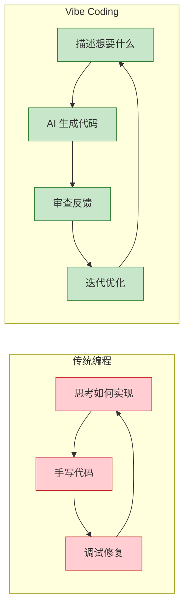
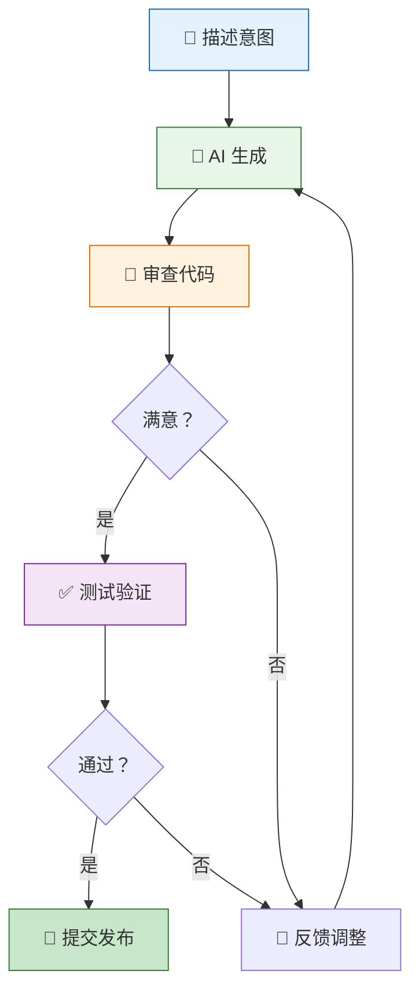

# Vibe Coding 技巧

Vibe Coding 是一种全新的编程方式——你描述意图，AI 来实现。不再纠结于语法细节和 API 记忆，而是把精力放在**想要构建什么**上。本篇分享 10 个实用技巧，帮你最大化 Claude Code 的 Vibe Coding 体验。

## 什么是 Vibe Coding

传统编程是**你写代码**，AI 辅助补全。Vibe Coding 是**你描述需求**，AI 写代码，你审查和引导。



### 思维转变

| 传统思维 | Vibe Coding 思维 |
|----------|------------------|
| "这个函数怎么写？" | "我需要一个处理用户注册的功能" |
| "这个 API 的参数是什么？" | "帮我调用支付接口完成扣款" |
| "为什么报这个错？" | "注册流程有 bug，帮我修" |
| "怎么写测试？" | "给这个模块加上完整测试" |

## 10 个实用技巧

### 1. 需求描述要具体

模糊的提示词会得到模糊的结果。越具体，AI 理解越准确。

```bash
# ❌ 模糊
> 帮我写个表单

# ✅ 具体
> 创建一个用户注册表单，包含：
> - 邮箱（必填，格式验证）
> - 密码（最少 8 位，包含大小写和数字）
> - 确认密码（必须匹配）
> - 使用 React Hook Form + Zod 验证
> - 提交后调用 /api/auth/register
```

### 2. 小步迭代，不要一次要求所有

把大任务拆成小步骤，每步验证后再进行下一步。

```bash
# ❌ 一次要求太多
> 帮我建一个完整的电商系统，包含商品管理、
> 购物车、订单、支付、物流跟踪...

# ✅ 分步进行
> 第一步：创建商品数据模型和 CRUD API
# （验证完成后）
> 第二步：创建商品列表页面，支持搜索和分页
# （验证完成后）
> 第三步：添加购物车功能
```

### 3. 善用截图和视觉反馈

使用 `/browse` skill 让 Claude 看到页面实际效果，基于视觉反馈来修改。

```bash
# 让 Claude 查看当前页面
> /browse http://localhost:3000/dashboard

# 基于视觉反馈修改
> 这个页面的侧边栏太宽了，导航文字也太小，
> 帮我调整一下布局
```

::: tip 视觉驱动开发
截图胜过千言万语。当你说"样式有问题"时，让 Claude 自己看到比你描述更高效。
:::

### 4. 先让 Claude 阅读现有代码

修改代码前，让 Claude 先理解现有的代码结构和风格。

```bash
# 先理解，再修改
> 先阅读 @src/components/DataTable.tsx 和
> @src/hooks/useTableData.ts，理解现有的
> 表格实现方式

# 然后基于理解来扩展
> 在现有表格基础上，添加列排序和筛选功能，
> 保持代码风格一致
```

### 5. 复杂功能先用 Plan Mode

对于涉及多个文件的复杂功能，先进入规划模式制定方案。

```bash
# 切换到 Plan Mode
> Shift + Tab  # 切换到 plan 模式

# 描述需求
> 我需要给系统添加多租户支持，
> 每个租户有独立的数据隔离

# Claude 会生成实施方案：
# 1. 数据库 schema 变更
# 2. 中间件添加租户识别
# 3. 查询层自动添加租户过滤
# 4. API 层权限校验
# ...

# 确认方案后切回执行模式实施
```

### 6. 信任但要验证

让 AI 写代码没问题，但要养成审查的习惯。

```bash
# Claude 生成代码后
> Allow this edit? [y/n/e]

# 按 e 打开编辑器检查
# 重点关注：
# - 业务逻辑是否正确
# - 边界条件是否处理
# - 是否有安全隐患
# - 是否符合项目规范
```

::: warning 不要盲目接受
Vibe Coding 不是"闭眼编程"。AI 可能会：
- 引入不必要的依赖
- 遗漏边界条件
- 使用过时的 API
- 产生与项目风格不一致的代码

每次 `[y/n/e]` 都是一次审查机会。
:::

### 7. 上下文太长时用 /compact

长时间对话会消耗 context window，及时压缩保持效率。

```bash
# 当对话变长时
/compact

# 或带自定义摘要提示
/compact 保留关于用户认证模块的所有决策
```

在以下时机使用 `/compact`：
- 对话超过 20 轮
- Claude 开始"忘记"之前讨论的内容
- 切换到不同的功能模块时

### 8. 组合使用 Skills

Claude Code 的 Skills 可以串联使用，形成完整工作流。

```bash
# 构建 → 测试 → 发布的完整流程

# 1. 开发功能
> 实现用户头像上传功能

# 2. QA 测试
> /qa

# 3. 准备发布
> /ship
```

常用组合：
- `/browse` + 修改 = 视觉驱动开发
- `/qa` + 修复 = 自动化测试修复
- `/review` + `/ship` = 代码审查后发布

### 9. 把模式沉淀到 CLAUDE.md

发现好的模式后，写入 CLAUDE.md 让 Claude 持续遵循。

```markdown
<!-- .claude/CLAUDE.md -->

## API 路由模式
- 所有 API 使用 Result<T, E> 返回类型
- 错误处理统一用 AppError 类
- 参考 src/api/users.ts 的实现模式

## 组件模式
- 表单组件统一用 React Hook Form + Zod
- 表格组件基于 @tanstack/react-table
- 弹窗统一用 Dialog 组件封装
```

### 10. 知道何时手动接管

AI 不是万能的。以下场景建议手动处理：

- **性能敏感的算法** — 需要精确控制的底层优化
- **复杂的状态管理逻辑** — 涉及多个异步流的交互
- **安全关键代码** — 加密、认证、权限的核心逻辑
- **微调 CSS 动画** — 像素级的视觉调整

```bash
# 可以让 Claude 搭框架
> 创建一个基于 Web Crypto API 的加密工具模块

# 但核心加密逻辑自己写或仔细审查
> 按 e 进入编辑器手动调整加密实现
```

## 反模式：避免这些做法

### 1. 模糊的提示词

```bash
# ❌ "帮我改一下那个页面"
# ❌ "代码有 bug，修一下"
# ❌ "优化一下性能"

# ✅ 指明具体的文件、问题和期望结果
```

### 2. 一次性改太多

```bash
# ❌ 在一轮对话中重构 10 个文件
# ❌ 同时修改数据库 + API + 前端 + 测试

# ✅ 一次专注一个模块，验证后再继续
```

### 3. 从不审查代码

```bash
# ❌ 所有 [y/n/e] 都直接按 y
# ❌ 不运行测试就认为改完了
# ❌ 不看 diff 就提交

# ✅ 至少扫一眼关键变更
# ✅ 改完后运行测试
# ✅ 提交前看 git diff
```

## 核心循环

Vibe Coding 的核心是一个快速迭代的循环：



**描述** → **生成** → **审查** → **测试** → **迭代**

这个循环越快，你的开发效率越高。Claude Code 的工具链（`/browse`、`/qa`、`/ship`）正是为加速这个循环而设计的。

## 小结

Vibe Coding 的核心不是"不写代码"，而是**把精力放在更高层次的思考上**：

- 产品设计而非语法细节
- 架构决策而非 API 记忆
- 业务逻辑而非样板代码
- 质量审查而非手动编写

掌握这 10 个技巧，你就能高效地与 Claude Code 协作，专注于真正重要的事情。

---

上一篇：[Telegram Bot 集成 ←](/zh/tutorials/telegram-bot) | 下一篇：[Settings 深度配置 →](/zh/advanced/settings-deep-dive)
